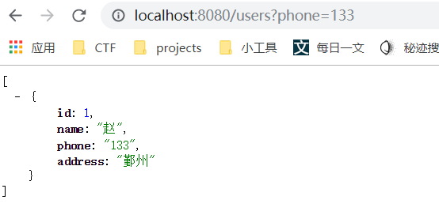
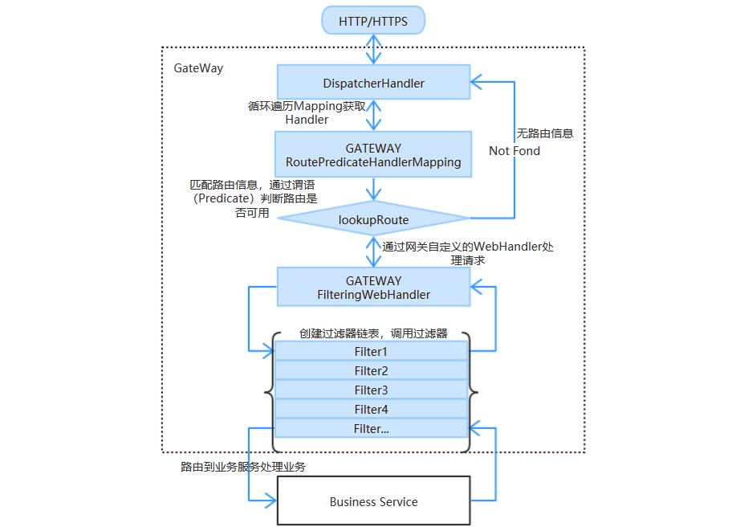
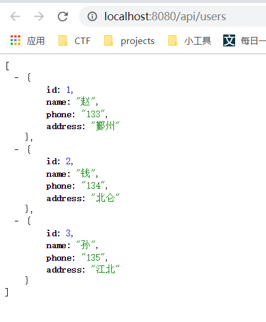
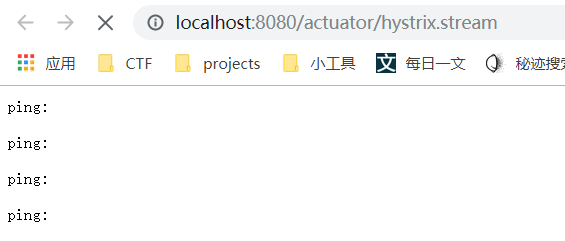
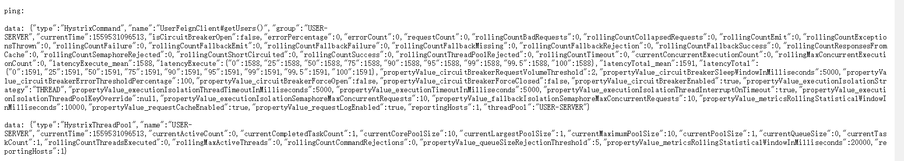

[TOC]


# 环境搭建

​	本次课程主要内容是完成微服务系统开发运行等相关环境的搭建，并通过Hello World工程验证所搭建的环境。


## 工具包

​	本次课程需要用到以下软件和工具，在tools下可以找到并安装，所有演示基于windows x64系统。

- IntelliJ IDEA
- lombok
- jdk1.8
- chrome  
- chrome_json插件
- postman
- Git


### IntelliJ IDEA

​	IDEA是一款高效的开发工具，提供了大量的快捷键和插件，同时也是业界公认的最合适搭配Maven的IDE。

   [Ctrl+鼠标左键 开始安装](./tools/ideaIC-2018.2.2.exe)


​	点击下一步


​	选择安装地址后，点击下一步


​	选择操作系统位数（64）和相关插件（java），点击下一步


​	点击安装


​	等待安装完成


​	完成安装


### Lombok

​	Lombok是一个java实用工具，可以帮助开发人员消除java的冗长，例如使用@Getter可以让代码在编译时自动生成getter方法；使用@Slf4j提供日志记录对象。为了使ide不在代码检测时报错，需要安装对应插件。在tools下提供了[Lombok插件的离线安装包](./tools/lombok-plugin-0.19-2018.EAP.zip)。	


​	打开IDEA后选择File -> Setting


​	选择Plugins，从本地安装插件，选择lombok-plugin-0.19-2018.EAP.zip，ok确认


​	点击ok安装


​	安装完成后需重启才能生效


### JDK

​	tools中提供了免安装的[jdk1.8.0_151.rar](./tools/jdk1.8.0_151.rar)，直接解压后就可以使用。


### Chrome

​	tools中提供了[Chrome安装包](./tools/ChromeStandalone_63.0.3239.132_Setup.rar)，安装过程比较简单，一直下一步到底即可。


### Chrome Json插件

​	Json插件可以帮助格式化json数据，推荐安装。


​	打开chrome，选择更多工具，扩展程序


​	打开开发者模式


​	将chrome_json.crx拖到页面上




​	选择添加扩展程序


​	安装成功后浏览器地址栏右侧会出现插件图标


​	如果提示无法添加，需要将.crx文件重命名成.zip，然后解压


​	选择加载已解压的扩展程序


​	安装的插件会提示是未封装的扩展程序，停止以开发者模式运行


​	删除插件，并重新拖动chrome_json.crx完成安装


### Postman

​	[Postman](./tools/postman64_xp510.rar)是一款很强大的api调试工具，安装比较简单，直接下一步到底即可，如果提示缺少[.NET Framework 4.5](./tools/dotnetfx45_full_x86_x64.exe)，请先先安装，再安装Postman。


### Git

​	GitLab是一个用于仓库管理系统的开源项目，使用Git作为代码管理工具。

​	本次课程的所有工程代码都托管在GitLab上，需要先在开发机上安装[Git客户端](./tools/Git-2.20.1-64-bit.exe)，Git客户端安装也比较简单，直接下一步到底即可。


# HelloWorld

​	按照国际惯例，我们以HelloWorld来验证我们搭建的环境。


## 获取demo工程

​	在GitLab上我们已经准备好了demo工程，可以直接通过浏览器访问[demo工程](http://12.99.117.73:3000/venus/demo)。大家可以使用Git Bash或者通过IDEA将GitLab上的demo仓库克隆到本地。


### Git Bash

​	大家可以直接使用Git Bash，获取GitLab上demo工程仓库


​	在空白处右键，选择打开Git Bash




​	执行克隆命令检出工程

```shell
git clone http://12.99.117.73:3000/venus/demo.git
```

​	

### IDEA

​	大家也可以通过IDEA获取demo工程仓库。


​	打开IDEA后选择

```shell
File -> New -> Project from Version COntrol -> Git
```


​	输入demo工程的仓库地址和检出的文件路径，点击clone就可以把仓库克隆到本地机器。


​	整体工程结构如上图所示，采用maven进行项目构建，src中为具体代码和配置。


## 运行demo工程

​	由于demo工程使用maven进行项目构建，在vd内需要通过settings文件将Nexus私服的信息告诉Maven，只要将[settings.xml](./tools/settings.xml)放到本地仓库（C:\Users\141398\.m2）下就行。如下图


​	

​	使用IDEA打开demo工程，在pom.xml右键，打开方式选择IDEA即可，然后等待Maven构建完成，第一次要下载较多依赖包，需要等待一段时间。

​	提示找不到jdk时，可按照下面步骤指定

```shell
File -> Project Structure
```


​	Maven构建完成后，在启动类右键运行Main函数就可以启动demo工程。


​	项目启动完成后，我们可以尝试访问[hello接口](http://127.0.0.1:8080/hello)和[beans接口](http://127.0.0.1:8080/beans)，两者都是get请求，直接通过浏览器访问即可。


# Spring Cloud

> Spring Cloud是一系列框架的有序集合，它利用Spring Boot 的开发便利性巧妙地简化了分布式系统基础设施的开发，如服务发现注册、配置中心、消息总线、负载均衡、断路器、数据监控等，都可以用Spring Boot 的开发风格做到一键启动和部署。


## Spring Cloud核心功能

- 分布式/版本化配置。
- 服务注册和发现。
- 路由。
- 服务和服务之间的调用。
- 负载均衡。
- 断路器。
- 分布式消息传递。


- 所有请求都统一通过 API 网关(Zuul)来访问内部服务。
- 网关接收到请求后，从注册中心(Eureka)获取可用服务。
- 由 Ribbon 进行均衡负载后，分发到后端的具体实例。
- 微服务之间通过 Feign 进行通信处理业务。
- Hystrix 负责处理服务超时熔断。
- Turbine 监控服务间的调用和熔断相关指标。


## 微服务、Spring Cloud、Spring Boot之间的关系

> 微服务是一种架构的理念，提出了微服务的设计原则，从理论为具体的技术落地提供了指导思想。
> Spring Boot 是一套快速配置脚手架，可以基于 Spring Boot 快速开发单个微服务。
> Spring Cloud 是一个基于 Spring Boot 实现的服务治理工具包;Spring Boot 专注于快速、方便集成的单个微服务个体;Spring Cloud 关注全局的服务治理框架。
> Spring Boot / Cloud 是微服务实践的最佳落地方案。


# 服务注册与发现-Eureka

> Spring Cloud Eureka是Spring Cloud Netflix服务套件中的一部分，它基于Netflix Eureka做了二次封装，主要负责完成微服务架构中的服务治理功能。


## Eureka Server工程搭建

​	本次课程所有案例都基于[demo](./demo.rar)进行开发。


### 创建Eureka Server工程

​	大家可以直接通过git获取[eureka工程](http://12.99.117.73:3000/venus/eureka.git)，或者按照下面步骤自己搭建工程。

​	将demo.rar解压，并改名为eureka，同时修改pom.xml中artifactId的值。修改完成后使用IDEA打开工程。

```xml
<artifactId>eureka</artifactId>
```


### 添加依赖包

​	在pom.xml中添加dependency

```xml
<dependency>
    <groupId>org.springframework.cloud</groupId>
    <artifactId>spring-cloud-starter-eureka-server</artifactId>
</dependency>
```


### 修改启动类

​	在启动类DemoApplication上添加注解@EnableEurekaServer

```java
@EnableEurekaServer
@SpringBootApplication
public class DemoApplication {

	public static void main(String[] args) {
		SpringApplication.run(DemoApplication.class, args);
	}

}
```


### 添加配置

```yml
spring:
  application:
    name: eureka
server:
  port: 8761

eureka:
  instance:
    hostname: localhost
  client:
    registerWithEureka: false # 在eureka server上注册自己以提供服务 作为server不需要
    fetchRegistry: false # 获取eureka server上的注册信息 作为server不需要
    serviceUrl:
      defaultZone: http://${eureka.instance.hostname}:${server.port}/eureka/

```


### 启动Eureka Server

​	在启动类DemoApplication上右键运行main方法即可，启动完成后访问[Eureka Server](http://localhost:8761/)。


## Eureka Client工程搭建

​	Eureka Client是一个服务提供者，当他向Eureka Server注册时，会提供一些元数据，例如主机、端口、ip地址等，Eureka Server在接受注册后会从client实例接收心跳信息，如果心跳超时会将client实例从注册列表中删除。


### 创建Eureka Client工程

​	[eureka-hello-client git](http://12.99.117.73:3000/venus/eureka-hello-client.git)

​	将demo.rar解压，并改名为eureka-hello-client，同时修改pom.xml中artifactId的值。修改完成后使用IDEA打开工程。

```xml
<artifactId>eureka-hello-client</artifactId>
```


### 添加依赖包

​	在pom.xml中添加dependency

```xml
<dependency>
    <groupId>org.springframework.cloud</groupId>
    <artifactId>spring-cloud-starter-eureka</artifactId>
</dependency>
```


### 修改启动类

​	在启动类DemoApplication上添加注解@EnableEurekaClient，并开放一个访问接口

```java
@SpringBootApplication
@EnableEurekaClient
@RestController
public class DemoApplication {

	public static void main(String[] args) {
		SpringApplication.run(DemoApplication.class, args);
	}

	@GetMapping("/hello")
	public String hello(){
		return "eureka-hello-client say hello!";
	}

}
```


### 添加配置

```yml
spring:
  application:
    name: eureka-hello-client
server:
  port: 8081

eureka:
  client:
    serviceUrl:
      defaultZone: http://localhost:8761/eureka/

```


### 启动Eureka Server

​	在启动类DemoApplication上右键运行main方法即可，启动完成后重新访问[Eureka Server](http://localhost:8761/)，可以看到注册上来的eureka-hello-client实例


​	

​	同时可以尝试访问eureka-hello-client提供[hello服务](http://localhost:8081/hello)。


# 网关-Zuul

​	网关是微服务架构中一个重要的组成部分，用来分割微服务和外部环境，外部流量统一通过网关调用微服务集群内部服务。网关主要包含以下功能：

- 验证（用户验证 应用鉴权）

- 路由（动态路由、灰度发布、服务迁移）

- 流量控制（熔断、降级）


### 创建Zuul工程

​	[zuul git](http://12.99.117.73:3000/venus/zuul.git)

​	将demo.rar解压，并改名为zuul，同时修改pom.xml中artifactId的值。修改完成后使用IDEA打开工程。

```xml
<artifactId>zuul</artifactId>
```


### 添加依赖包

​	在pom.xml中添加dependency

```xml
<dependency>
    <groupId>org.springframework.cloud</groupId>
    <artifactId>spring-cloud-starter-eureka</artifactId>
</dependency>

<dependency>
    <groupId>org.springframework.cloud</groupId>
    <artifactId>spring-cloud-starter-zuul</artifactId>
</dependency>
```


### 修改启动类

​	在启动类DemoApplication上添加注解@EnableEurekaClient，@EnableZuulProxy

```java
@SpringBootApplication
@EnableZuulProxy
@EnableEurekaClient
public class DemoApplication {

	public static void main(String[] args) {
		SpringApplication.run(DemoApplication.class, args);
	}

}
```


### 添加配置

```yml
spring:
  application:
    name: zuul
server:
  port: 8765

eureka:
  client:
    serviceUrl:
      defaultZone: http://localhost:8761/eureka/

zuul:
  routes:
    eureka-hello-client: /api/hello/**  # /api/hello的请求都转发到eureka-hello-client
```


### 启动Zuul

​	在启动类DemoApplication上右键运行main方法即可，启动完成后重新访问[Eureka Server](http://localhost:8761/)，可以看到注册上来的zuul实例



​	

​	尝试通过网关访问eureka-hello-client提供[hello服务](http://localhost:8765/api/hello/hello)。


# Feign

​	Feign是一个声明式的Web Service客户端，它的目的就是让Web Service调用更加简单，Feign提供了HTTP请求的模板，通过编写简单的接口并添加注解，就完成HTTP请求参数、格式、地址等信息的定义。

​	使用Feign代理HTTP请求，我们只需要像调用方法一样调用它就可以完成服务请求机相关处理。同时Feign也整合了Ribbon和Hystrix，可以让我们不再需要显示的使用这两个组件。

​	这里我们创建feign-client和feign-server两个工程，请求调用方式如下


## 创建feign-client

​	将demo.rar解压，并改名为feign-client，同时修改pom.xml中artifactId的值。修改完成后使用IDEA打开工程。

```xml
<artifactId>feign-client</artifactId>
```


### 添加依赖包

​	在pom.xml中添加dependency

```xml
<dependency>
    <groupId>org.springframework.cloud</groupId>
    <artifactId>spring-cloud-starter-eureka</artifactId>
</dependency>

<dependency>
    <groupId>org.springframework.cloud</groupId>
    <artifactId>spring-cloud-starter-feign</artifactId>
</dependency>
```


### 创建访问Feign Server接口

​	新建一个访问Feign Server的接口，用来调用feign-server提供的hello接口

```java
@FeignClient(name = "feign-server")
public interface FeignServer {

    @GetMapping("/hello")
    public String hello();
}

```


### 修改启动类

​	在启动类DemoApplication上添加注解@EnableEurekaClient，@EnableFeignClients

```java
@SpringBootApplication
@EnableEurekaClient
@RestController
@EnableFeignClients
public class DemoApplication {

	public static void main(String[] args) {
		SpringApplication.run(DemoApplication.class, args);
	}

	@Autowired
	private FeignServer feignServer;

	@GetMapping("/hello")
	public String hello(){
		return "feign-client say hello !  "+ feignServer.hello();
	}

}

```


### 添加配置

```yml
spring:
  application:
    name: feign-client
server:
  port: 9081

eureka:
  client:
    serviceUrl:
      defaultZone: http://localhost:8761/eureka/
```


### 启动feign-client

​	在启动类DemoApplication上右键运行main方法即可，启动完成后重新访问[Eureka Server](http://localhost:8761/)，可以看到feign-client的实例也注册到了Eureka上


​	

​	由于暂无feign-server提供服务，这时访问hello接口会出现异常，这类异常的处理方式会在后续内容中进行讲解，我们先来提供feign-server的服务。


## 创建feign-server

​	将demo.rar解压，并改名为feign-server，同时修改pom.xml中artifactId的值。修改完成后使用IDEA打开工程。

```xml
<artifactId>feign-server</artifactId>
```


### 添加依赖包

​	在pom.xml中添加dependency

```xml
<dependency>
    <groupId>org.springframework.cloud</groupId>
    <artifactId>spring-cloud-starter-eureka</artifactId>
</dependency>

```


### 修改启动类

​	在启动类DemoApplication上添加注解@EnableEurekaClient

```java
@SpringBootApplication
@EnableEurekaClient
@RestController
public class DemoApplication {

	public static void main(String[] args) {
		SpringApplication.run(DemoApplication.class, args);
	}

	@GetMapping("/hello")
	public String hello(){
		return "feign-server say hello !";
	}
}
```


### 添加配置

```yml
spring:
  application:
    name: feign-server
server:
  port: 9082

eureka:
  client:
    serviceUrl:
      defaultZone: http://localhost:8761/eureka/
```


### 启动feign-server

​	在启动类DemoApplication上右键运行main方法即可，启动完成后重新访问[Eureka Server](http://localhost:8761/)，可以看到feign-server的实例也注册到了Eureka上


​	我们可以先访问以下feign-server的[hello接口](http://localhost:9082/hello)，可以看到返回了

```
feign-server say hello !
```


​	然后我们来访问feign-client的[hello接口](http://localhost:9081/hello)，可以看到返回内容中带上了feign-server的hello接口返回的内容

```
feign-client say hello ! feign-server say hello !
```


# Hystrix

​	Hystrix在微服务体系内最主要的作用就是解决接口调用异常是引起的雪崩效应，它通过以下几个机制解决这一问题：

- 隔离：限制调用分布式服务的资源使用，某一个调用的服务出现问题不会影响其他服务调用。
- 降级：超时降级、资源不足时降级等，降级后可以配合降级接口返回托底数据。
- 熔断：当接口调用失败率达到阈值时自动触发降级，熔断器触发的快速失败会进行快速恢复。
- 缓存：提供了请求缓存和请求合并机制。


## 降级实现

​	回到之前的那个问题中，当feign-client请求feign-server的hello接口时，但是feign-server此时无法提供服务。为了不因为一个节点的故障而造成整个服务群无法提供服务，我们需要对hello接口的调用实现降级处理。


### 创建feign-client-fallback

​	复制feign-client工程，并改名为feign-client-fallback，同时修改pom.xml中artifactId的值。修改完成后使用IDEA打开工程。

```xml
<artifactId>feign-client-fallback</artifactId>
```


### 修改访问Feign Server接口

​	为FeignServer接口执行降级实现类

```java
@FeignClient(name = "feign-server", fallback = FeignServerFallback.class)
public interface FeignServer {

    @GetMapping("/hello")
    public String hello();
}

```


### 修改配置

​	这个我们需要修改以下application.name和server.port，并开启hystrix。

```yml
spring:
  application:
    name: feign-client-fallback
server:
  port: 9083

eureka:
  client:
    serviceUrl:
      defaultZone: http://localhost:8761/eureka/

feign:
  hystrix:
    enabled: true
```


### 实现FeignServerFallback

```java
@Component
public class FeignServerFallback implements FeignServer {
    @Override
    public String hello() {
        return "feign-server no answer";
    }
}

```


### 启动feign-client-fallback

​	在启动类DemoApplication上右键运行main方法即可，启动完成后重新访问[Eureka Server](http://localhost:8761/)，可以看到feign-client-fallback的实例也注册到了Eureka上


​	我们尝试访问[feign-client](http://localhost:9081/hello)和[feign-client-fallback](http://localhost:9083/hello)，两个服务都可以得到正常响应。

```
feign-client say hello ! feign-server say hello !
```


​	然后我们关闭feign-server工程，再次尝试访问[feign-client](http://localhost:9081/hello)和[feign-client-fallback](http://localhost:9083/hello)，现在只用feign-client-fallback可以正常响应，feign-client变成了异常页面。

```
feign-client say hello ! feign-server no answer
```




## 熔断实现

​	熔断机制的原理是当接口调用失败率达到阈值时自动触发降级。

​	熔断器一共有三种状态：

- 关闭状态：单位时间内api调用失败次数小于设定阈值时，熔断器处于关闭状态，此时该api可以正常提供服务。
- 打开状态：单位时间内api调用失败次数大于设定阈值时，熔断器处于打开状态，此时请求该api会直接进入fallback逻辑，而不是调用实际api接口。
- 半开状态：一段时间后处于打开状态的熔断器会进入半开状态，并将一定数量的请求调用实际api接口，其他请求仍然直接进入fallback逻辑。若api接口调用失败，熔断器重新进入打开状态；若api调用成功，熔断器恢复到关闭状态。

​	

	### 创建feign-client-hystrix

​	复制feign-client-fallback工程，并改名为feign-client-hystrix，同时修改pom.xml中artifactId的值。修改完成后使用IDEA打开工程。

```xml
<artifactId>feign-client-hystrix</artifactId>
```


### 修改启动类

​	在启动类DemoApplication上添加注解@EnableCircuitBreaker来开启熔断器

```java
@SpringBootApplication
@EnableEurekaClient
@RestController
@EnableFeignClients
@EnableCircuitBreaker
public class DemoApplication {

	public static void main(String[] args) {
		SpringApplication.run(DemoApplication.class, args);
	}

	@Autowired
	private FeignServer feignServer;

	@GetMapping("/hello")
	public String hello(){
		return "feign-client say hello !  "+ feignServer.hello();
	}

}
```


### 修改配置

​	这个我们需要修改以下application.name和server.port，并调整hystrix配置（演示效用更加清楚），下面配置主要实现的功能是20秒内两次调用失败，打开熔断器；熔断器打开后，每5秒将熔断器调整为半开状态。

```yml
spring:
  application:
    name: feign-client-hystrix
server:
  port: 9084

eureka:
  client:
    serviceUrl:
      defaultZone: http://localhost:8761/eureka/

feign:
  hystrix:
    enabled: true

hystrix:
  command:
    default:
      execution:
        isolation:
          thread:
            timeoutInMilliseconds: 20000 # 配置HystrixCommand的超时时间（毫秒），执行超过该配置值时HystrixCommand被标记为TIMEOUT，并进入降级处理逻辑。
      circuitBreaker:
        requestVolumeThreshold: 2 # 设置在一个滚动窗口中（默认值10秒），打开断路器的最少请求数。
        sleepWindowInMilliseconds: 5000 # 设置断路器打开后休眠时间窗, 休眠时间窗结束后，会将断路器置为“半开”状态，尝试熔断的请求命令，如果成功将断路器置为“打开”状态，失败则继续置为“关闭”状态。
        errorThresholdPercentage: 100 # 设置断路器打开的错误百分比，在滚动时间窗中，请求数超过circuitBreaker.requestVolumeThreshold的前提下，如果错误请求是超过此百分比，就把断路器设置为“打开”，否则设置为“关闭”
  threadpool:
    default:
      metrics:
        rollingStats:
          timeInMilliseconds: 20000 # 设置统计的滚动窗口的时间段大小（毫秒）
          numBuckets: 1 # 设置滚动的统计窗口被分成的桶（bucket）的数目。
```


### 启动feign-client-hystrix

​	在启动类DemoApplication上右键运行main方法即可，启动完成后重新访问[Eureka Server](http://localhost:8761/)，可以看到feign-client-hystrix的实例也注册到了Eureka上




### 验证熔断器

​	保持feign-server正常服务，然后调用[feign-client-hystrix](http://localhost:9084/hello)，请求能正常返回。


​	然后停止feign-server的服务，再次调用[feign-client-hystrix](http://localhost:9084/hello)，请求调用异常，前两次调用需要调用需要请求feign-server，响应时间较长，后续请求直接进入fallback，响应较快。


​	


