[TOC]


# 微服务简介

微服务的概念源于2014年3月Martin Fowler所写的一篇文章[Microservices](http://martinfowler.com/articles/microservices.html)。

> In short, the microservice architectural style is an approach to developing a single application as a suite of small services, each running in its own process and communicating with lightweight mechanisms, often an HTTP resource API. These services are built around business capabilities and independently deployable by fully automated deployment machinery. There is a bare minimum of centralized management of these services, which may be written in different programming languages and use different data storage technologies.

​	简而言之，微服务体系结构风格是一种将单个应用程序开发为一组小型服务的方法，每个服务运行在自己的进程中，并通过轻量级机制(通常是HTTP资源API)通信。这些服务是围绕业务功能构建的，并且可以通过完全自动化的部署机制独立部署。这些服务基本不需要集中化的管理，可以用不同的编程语言编写，和使用不同的数据存储技术。


## Spring Cloud与Dubbo与微服务

​	微服务是一种架构风格，能给软件应用开发带来很大便利。虽然马丁明确了微服务的定义，但是在实际执行过程中，微服务的实施和落地还是会面临很大的挑战，因此需要一套整体的解决方案来解决实施和落地的问题。

​	目前开源可选用的微服务框架主要有Dubbo、Spring Cloud。


### Spring Cloud

​	在2014年年底，Spring团队推出了Spring Cloud，致力于推进Java领域微服务框架落地，发展到现在，Spring Cloud已经成为Java领域落地微服务架构的完整解决方案。


#### Spring Cloud的优点

- 开发简单上手快。
- 由众多子项目组成，提供了搭建分布式系统及微服务常用的工具，满足了构建微服务所需的所有解决方案。


#### Spring Cloud的缺点

- springcloud的接口协议约定比较自由且松散。
- 什么都有，很多功能不健全。


### Dubbo

​	Dubbo是 阿里巴巴公司开源的一个高性能优秀的服务框架，使得应用可通过高性能的 RPC 实现服务的输出和输入功能。2013年阿里曾停止Dubbo的更新，后于2017年重组团队，恢复更新。


#### Dubbo的优点

- Dubbo由于是二进制的传输，占用带宽会更少。
- Dubbo具有调度、发现、监控、治理等功能，支持相当丰富的服务治理能力。


#### Dubbo的缺点

- Dubbo的jar包依赖问题导致Dubbo的开发难度较大。
- 只专注于服务治理，配套设施不足，只是解决方案的一部分。


### 为什么Spring Cloud

​	我们选择Spring Cloud主要是出于以下几点考虑

- Dubbo并不是一套完成的解决方案。
- Spring Cloud更容易上手，开发更快。
- Spring Cloud更适合业务逻辑复杂、处理时间长而导致异步逻辑比较多的场景。
- Dubbo现已加入Spring Boot。


# 课程内容

​	2018年6月，Spring Cloud官方发布了新的版本Finchley，接下去的讲解也是基于此版本展开，带大家熟悉Spring Cloud，简单了解微服务如何落地与实施。


# 开发环境准备

​	在正式进入实战之前，我们需要先准备一下相关的环境与工具。


## Intellij IDEA

​	Intellij IDEA是一款高效的开发工具，提供了大量的快捷键和插件来提高我们的开发效率，同时也是业界公认的最适合搭配Maven的IDE。

​	安装过程一直下一步即可，中间有一部选择操作系统位数和插件，根据实际情况选择。


## Maven

​	Maven 是一个项目管理工具，可以对 Java 项目进行构建、依赖管理。在Intellij IDEA中已经内置了Maven，所以我们不需要另外安装。介于国内的网络环境，我们需要将Maven仓库改到ali的镜像仓库，可以大大加快依赖下载速度，只要将settings.xml放到本地Maven仓库路径下即可。


## Lombok

> Project Lombok is a java library that automatically plugs into your editor and build tools, spicing up your java.
>
> Never write another getter or equals method again, with one annotation your class has a fully featured builder, Automate your logging variables, and much more.


​	Lombok是一个java实用库，可以帮助开发人员简化java开发，通过注解就可以生成Getter、Setter、构造器，日志对象等。由于Lombok是在编译时才产生作用，为了使IDE在代码检测时不报错，需要安装一下插件。

​	在Settings（File->Settings）中选择Plugins，搜索Lombok，安装即可。

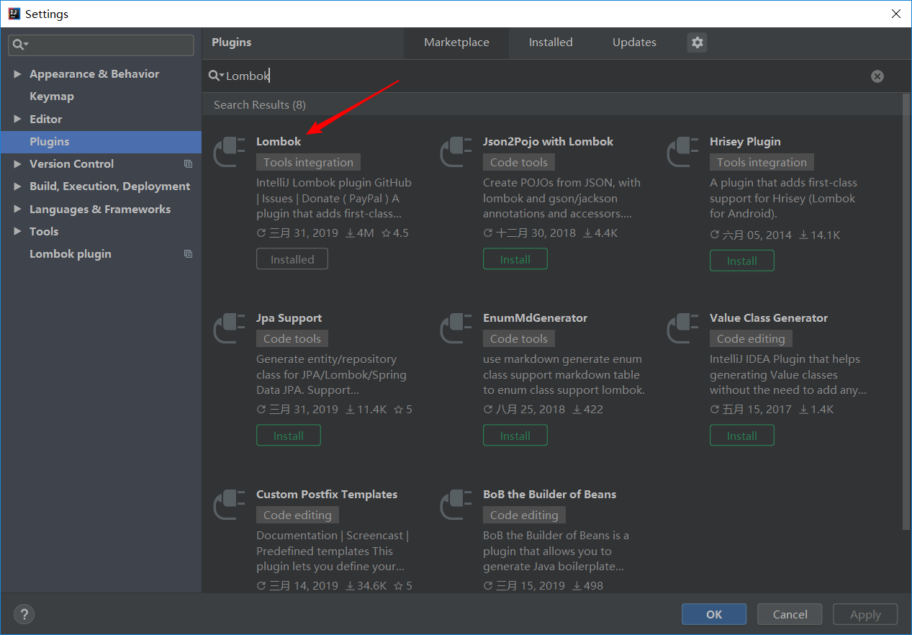

​	如果下载较慢可以直接从本地安装已下载的插件。

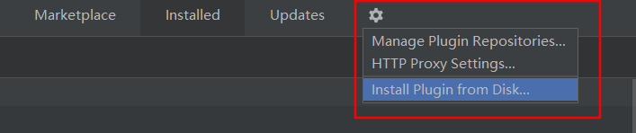


## JDK

​	对于JDK这里不做过多解释，这里使用jdk1.8.0_151版本，直接解压即可。


## 浏览器

​	为方便接口调试Chrome或者Firefox，建议安装一下JsonView，这里提供了Chrome的插件。


## Postman

​	Postman时一款功能强大的api调试工具，安装应用或者浏览器插件都可以，这里提供了应用安装包。


## Git

​	Git是一个开源的分布式版本控制系统，本课程的所有工程源码都会上传到GitHub，大家可以直接下载，GitHub地址时是<https://github.com/rk-pisces/spring-cloud-get-start>。

​	访问GitHub需要在本地安装一下Git客户端，默认安装即可。


## Httpd

​	httpd是Apache的HTTP服务器，我们经常会使用Httpd搭建Web服务器，除了web服务器功能外，Httpd中还

自带了abTest接口压测工具，可以执行简单的压力测试，无需安装，直接解压就行。本课程中某些场景需要通过abTest的并发请求来验证，也可以使用JMeter等压测工具。


# 环境验证

​	安装国际惯例，我们使用一个HelloWorld工程来验证我们的环境。Spring Boot作为“开箱即用”的开源框架，在Spring的基础上帮我们省去了样板化的配置，让我们能够更专注于应用程序功能的开发。


## 获取初始工程

​	我们可以直接从 [Spring Initializr](https://start.spring.io/)直接下载一个初始工程。

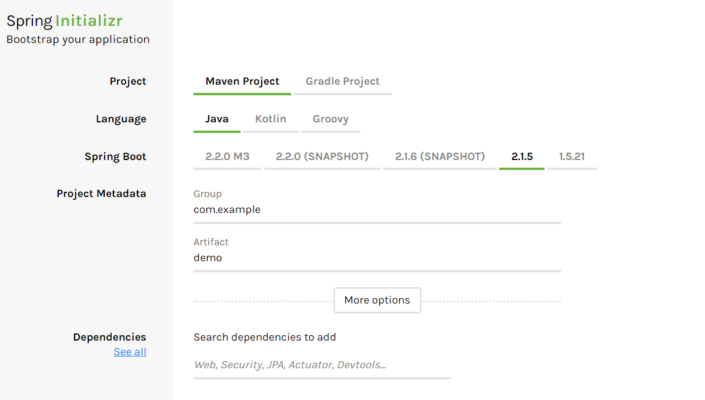

​	

## 项目结构

​	解压后直接使用Intellij IDEA打开pom.xml，第一次打开需要下载相关依赖，时间会比较长。创建完成后，可以看到项目结构如下。


​	这是一个标准的Maven项目结构，其中比较重要的几个文件为DemoApplication.java、application.properties、pom.xml。

​	DemoApplication.java时Spring Boot自动生成的启动类，有了这个类，这个项目已经是一个可以运行的Spring Boot工程了。

​	application.properties是Spirng Boot默认的配置文件。

​	pom.xml是Maven项目的配置文件，主要描述了项目的Maven坐标、依赖关系等信息。


## Hello World

​	想要启动一个可以通过网络请求访问的Hello World，我们需要在pom.xml中添加web相关的依赖，Spring Boot直接给我们提供了starter-web的依赖。

```xml
<dependency>
	<groupId>org.springframework.boot</groupId>
	<artifactId>spring-boot-starter-web</artifactId>
</dependency>
```

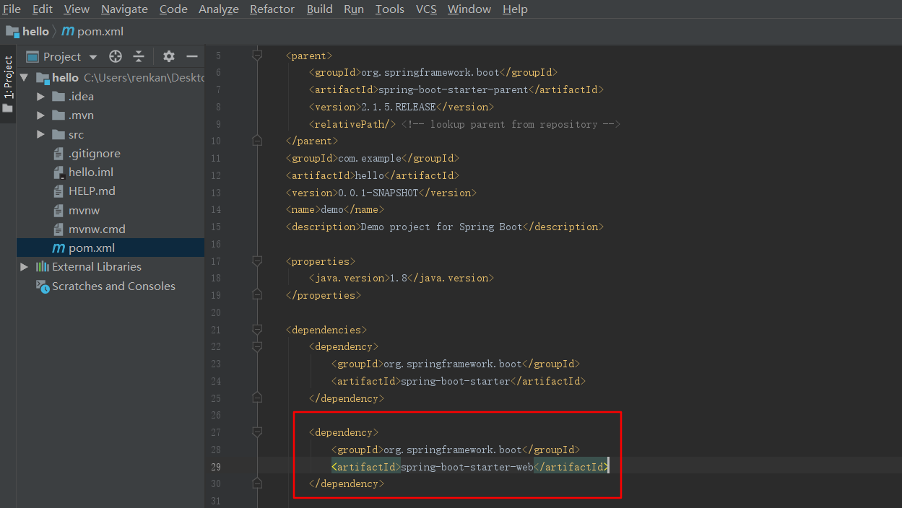

​	然后创建一个Api.java类，用于声明接口开放。

```java
package com.example.demo;

import org.springframework.web.bind.annotation.GetMapping;
import org.springframework.web.bind.annotation.RestController;

@RestController
public class Api {
    
    @GetMapping("/hello")
    public String hello(){
        return "Hello World !";
    }
}
```

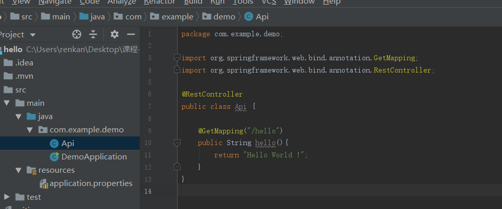

​	

## 项目启动

​	想要启动Spring Boot，只要直接运行DemoApplication.java的main函数即可，在启动日志中可以看到tomcat启动，端口为8080。


​	

## 请求验证

​	通过浏览器访问[http://localhost:8080/hello](http://localhost:8080/hello)，结果如下

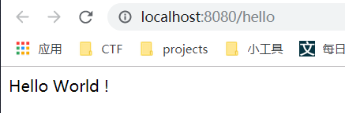


## 反观Spring Mvc

​	使用Spring Boot只需简单几行代码就可以完成一个Web应用程序的搭建，回过头来我们看一下使用Spring Mvc搭建一个Web应用需要几个步骤。

 	1. 创建一个java工程，添加Spring MVC和Servlet API等依赖。
 	2. 新建一个web.xml文件(或者一个WebApplicationInitializer实现类)，其中声明了Spring的DispatcherServlet。
 	3. 一个启用Spring MVC的Spring配置。
 	4. 一个控制器类，以"Hello World"响应HTTP请求。
 	5. 一个用于部署应用程序的Web应用服务器，比如Tomcat。

​	虽然使用Spring Mvc搭建Web应用的步骤也不多，但是1、2、3三个步骤中的文件一般都需要从现有工程或从网上复制，往往完成一个应用搭建需要花费1-2个小时时间，费时费力还容易出错。

​	而使用Spring Boot只需短短几分钟就能完成一个Web应用的搭建。


# Spring Boot

> Spring Boot makes it easy to create stand-alone, production-grade Spring based Applications that you can "just run".
>
> We take an opinionated view of the Spring platform and third-party libraries so you can get started with minimum fuss. Most Spring Boot applications need very little Spring configuration.

​	Spring Boot是由Pivotal团队提供的全新框架，其设计目的是用来简化新Spring应用的初始搭建以及开发过程。该框架使用了特定的方式来进行配置，从而使开发人员不再需要定义样板化的配置。


## Spring Boot特点

> - Create stand-alone Spring applications
> - Embed Tomcat, Jetty or Undertow directly (no need to deploy WAR files)
> - Provide opinionated 'starter' dependencies to simplify your build configuration
> - Automatically configure Spring and 3rd party libraries whenever possible
> - Provide production-ready features such as metrics, health checks and externalized configuration
> - Absolutely no code generation and no requirement for XML configuration

- 独立的Spring应用
- 内置Tomcat、Jetty、Undertow
- starter依赖简化配置
- 自动配置Spring和第三方库
- 提供度量、健康检查、外部配置等生产需要的功能
- 无代码生成和XML配置要求


## Spring Boot与Maven

​	Spring Boot项目支持使用Maven或Gradle来搭建，在本课程中，我们选择使用Maven来搭建Spring Boot项目。


### 什么是Maven

>  We wanted a standard way to build the projects, a clear definition of what the project consisted of, an easy way to publish project information and a way to share JARs across several projects.

- Java项目的标准构建方式

- 定义工程的组成
- 发布项目信息的方式
- 在几个项目中共享jar包


### pom.xml

​	pom作为项目对象模型。通过xml表示maven项目，使用pom.xml来实现。

​	主要描述了以下项目信息：配置文件、开发者需要遵循的规则、缺陷管理系统、组织和licenses、项目的url、项目的依赖性、以及其他所有的项目相关因素。

​	demo中的pom.xml如下：

```xml
<?xml version="1.0" encoding="UTF-8"?>
<!-- project是Maven项目的根标签 -->
<project xmlns="http://maven.apache.org/POM/4.0.0" xmlns:xsi="http://www.w3.org/2001/XMLSchema-instance"
	xsi:schemaLocation="http://maven.apache.org/POM/4.0.0 http://maven.apache.org/xsd/maven-4.0.0.xsd">
    
    <!-- Maven的版本 -->
	<modelVersion>4.0.0</modelVersion>
    
    <!-- 继承标签 -->
	<parent>
        <!-- groupId一般为企业网址反写+项目名  -->
		<groupId>org.springframework.boot</groupId>
        <!-- 项目名-模块名 -->
		<artifactId>spring-boot-starter-parent</artifactId>
        <!-- 版本 -->
		<version>2.1.5.RELEASE</version>
		<relativePath/> <!-- lookup parent from repository -->
	</parent>
    
	<groupId>com.example</groupId>
	<artifactId>hello</artifactId>
	<version>0.0.1-SNAPSHOT</version>
    <!-- 项目名称 -->
	<name>demo</name>
    <!-- 项目描述 -->
	<description>Demo project for Spring Boot</description>

    <!-- 属性标签 内部可定义变量 通过${属性名}方式获取属性值 -->
	<properties>
		<java.version>1.8</java.version>
	</properties>

    <!-- 依赖标签 内部为工程依赖描述 -->
	<dependencies>
        
        <!-- 一个依赖 通过groupId、artifactId、version指定依赖的坐标 
			这里没有version会从parent中获取 -->
		<dependency>
			<groupId>org.springframework.boot</groupId>
			<artifactId>spring-boot-starter</artifactId>
		</dependency>

		<dependency>
			<groupId>org.springframework.boot</groupId>
			<artifactId>spring-boot-starter-web</artifactId>
		</dependency>

		<dependency>
			<groupId>org.springframework.boot</groupId>
			<artifactId>spring-boot-starter-test</artifactId>
            <!-- 依赖范围 常用值compile/provided/test/runtime-->
			<scope>test</scope>
		</dependency>
	</dependencies>

    <!-- 项目支持标签 一般用来引入插件 -->
	<build>
        <!-- 插件标签 -->
		<plugins>
            <!-- 一个插件 通过groupId、artifactId、version指定插件的坐标 -->
			<plugin>
				<groupId>org.springframework.boot</groupId>
				<artifactId>spring-boot-maven-plugin</artifactId>
			</plugin>
		</plugins>
	</build>
</project>

```


# Spring Boot开发实战

​	在前面的Hello World的例子中，我们简单讲了如何通过Spring Boot搭建一个Web项目，如何从开放一个Get请求接口，如何启动项目。在这一课中，我们会讲解如何使用Spring Boot快速完成功能开发。


## 场景定义

​	假设有一个微服务的项目提供用户相关服务，包含以下几个接口。

- 获取用户列表 

- 根据id获取用户信息

- 根据手机号查询用户信息

- 添加用户

- 删除用户

- 修改用户信息

  用户（user）包含以下几个属性。

- id  主键
- name 姓名
- phone 手机号
- address 住址


## RESTful

​	在微服务中，我们一般采用RESTful的风格来设计我们的接口。

​	相比于SOAP协议，REST更加简单明了，无论是对URL的处理还是对Payload的编码，REST都倾向于用更加简单轻量的方法设计和实现。

​	与SOAP不同，REST并没有一个明确的标准，而更像是一种设计的风格。

​	REST完全遵循HTTP协议，在HTTP的基础上，REST在接口设计上又添加了一定的设计原则和约束条件，满足这些设计原则和约束条件的应用程序或设计就是 RESTful的。

​	REST的主要设计原则与约束条件如下：

- URL由”动词+名词“组成，动词指定请求方式（GET、POST），名词指定请求对象（users）。
- 名字一般使用复数形式，表示对象资源的集合。
- 只在正确返回时使用2XX的返回码，异常情况下使用其他返回码。
- 请求数据和响应数据不为空时使用结构化的数据，不要使用纯文本。


## 接口定义

​	根据REST的原则，我们完成对应的接口定义

- 获取用户列表

  ```http
  GET /users
  ```

- 根据id获取用户信息

  ```http
  GET /users/{id}
  ```

- 根据手机号查询用户信息

  ```http
  GET /users?phone={phone}
  ```

- 添加用户

  ```http
  POST /users
  {
  	name:{name},
  	phone:{phone},
  	address:{address}
  }
  ```

- 删除用户

  ```http
  DELETE /users/{id}
  ```

- 修改用户信息

  ```http
  PATCH /users
  {
  	id:{id},
  	name:{name},
  	phone:{phone},
  	address:{address}
  }
  ```


## 接口实现

​	根据场景与接口定义，我们将接口代码化，完成用户微服务。


### 创建user项目

​	与Hello World相同，我们从demo创建user微服务。将demo.zip解压后，修改pom.xml中artifactId的值，然后打开项目。


​	

### 添加依赖

​	添加spring-boot-starter-web和lombok依赖。

```xml
<dependency>
    <groupId>org.springframework.boot</groupId>
    <artifactId>spring-boot-starter-web</artifactId>
</dependency>

<dependency>
    <groupId>org.projectlombok</groupId>
    <artifactId>lombok</artifactId>
</dependency>
```


### 创建User类

​	根据上面对用户的定义编写User类。

```java
package com.example.demo;

import lombok.Data;

@Data
public class User {

    private Long id;

    private String name;

    private String phone;

    private String address;
}

```

​	@Data是lombok提供的注解，会在编译时生成getter、setter、equals、hashCode、toString等方法。

通过jd-gui查看编译后的jar，可以看到添加的代码。

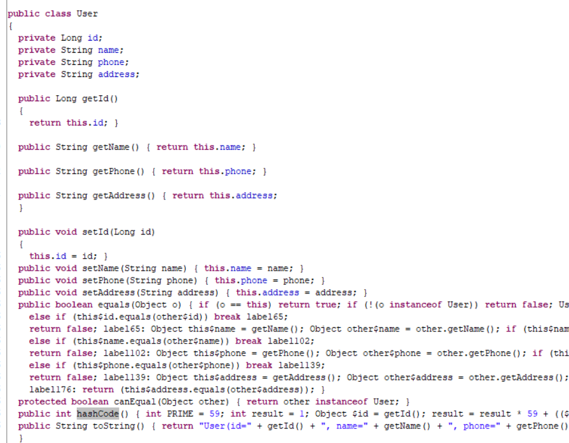

​	也可以使用@NoArgsConstructor和@AllArgsConstructor注解来生成无参构造器和全参构造器；使用@Slf4j注解来生成log对象。


### 实现接口和逻辑

​	创建UserApi类来提供用户操作的接口；UserService类完成相应逻辑处理。


#### 获取用户列表

```http
GET /users
```

```java
// UserApi
@GetMapping("/users")
public List<User> getUsers() {
	return userService.getUsers();
}

// UserService
public List<User> getUsers() {
    return Arrays.asList(
        new User(1L, "赵", "133", "鄞州"),
        new User(2L, "钱", "134", "北仑"),
        new User(3L, "孙", "135", "江北")
    );
}
```

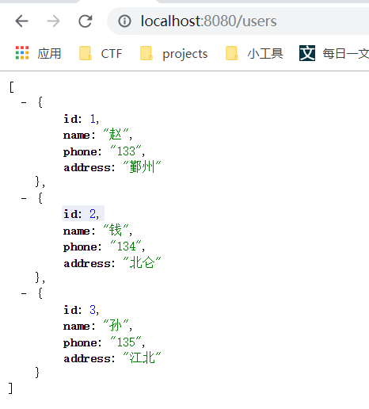


#### 根据id获取用户信息

```http
GET /users/{id}
```

```java
// UserApi
@GetMapping("/users/{id}")
public User getUser(@PathVariable Long id) {
    return userService.getUser(id);
}

// UserService
public User getUser(Long id) {
    if (1L == id) {
        return new User(1L, "赵", "133", "鄞州");
    } else {
        return null;
    }
}
```

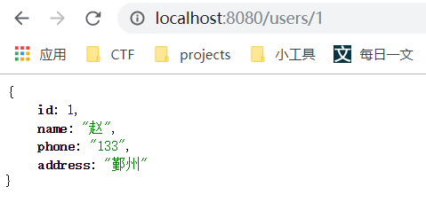


#### 根据手机号查询用户信息

根据手机号查询用户信息与获取用户列表的URL一致，所以这里要修改getUsers接口，支持根据手机号查询。

```http
GET /users?phone={phone}
```

```java
// UserApi
@GetMapping("/users")
public List<User> getUsers(@Nullable @RequestParam("phone") String phone) {
    if (null == phone || phone.isEmpty()) {
        return userService.getUsers();
    } else {
        return userService.getUserByPhoneNo(phone);
    }
}

// UserService
public List<User> getUserByPhoneNo(String phone) {
    if ("133".equals(phone)) {
        return Arrays.asList(new User(1L, "赵", "133", "鄞州"));
    } else {
        return null;
    }
}
```


#### 添加用户

```http
POST /users
{
	name:{name},
	phone:{phone},
	address:{address}
}
```

```java
// UserApi
@PostMapping("/users")
public void createUser(@RequestBody User user) {
    userService.create(user);
}

// UserService
public void create(User user) {
    log.info("==== create user:{} ====", user);
}
```

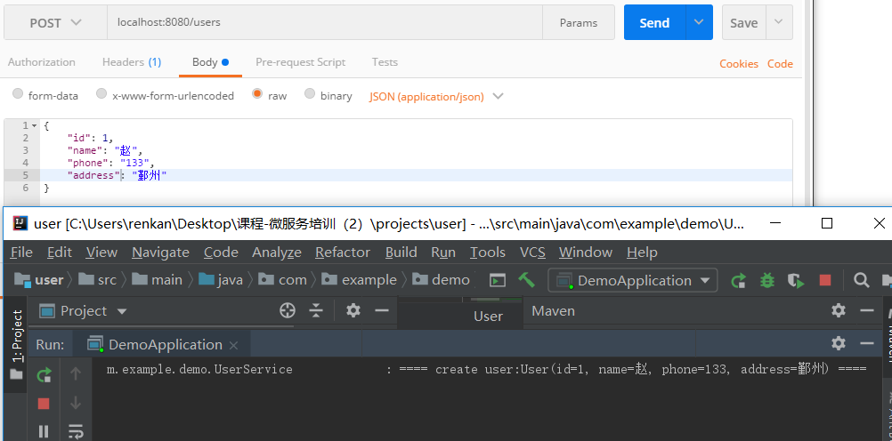


#### 删除用户

```http
DELETE /users/{id}
```

```java
// UserApi
@DeleteMapping("/users/{id}")
public void deleteUser(@PathVariable Long id) {
    userService.delete(id);
}

// UserService
public void delete(Long id) {
    log.info("==== delete user:{} ====", id);
}
```

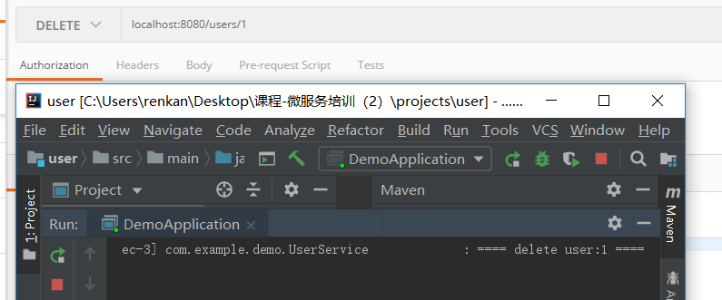


#### 修改用户信息

```http
PATCH /users
{
	id:{id},
	name:{name},
	phone:{phone},
	address:{address}
}
```

```java
// UserApi
@PatchMapping("/users")
public void updateUser(@RequestBody User user) {
    userService.update(user);
}

// UserService
public void update(User user) {
    log.info("==== update user:{} ====", user);
}
```

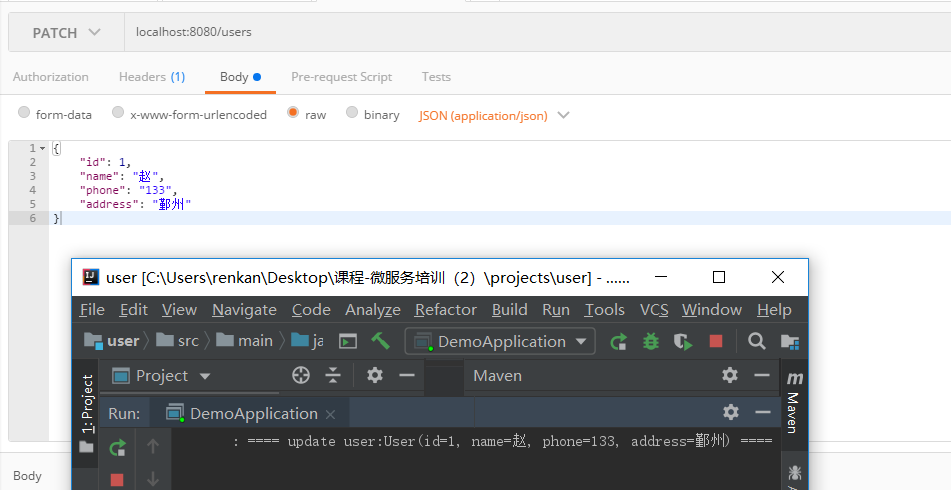


# Spring Cloud

> Spring Cloud是一系列框架的有序集合，它利用Spring Boot 的开发便利性巧妙地简化了分布式系统基础设施的开发，如服务发现注册、配置中心、消息总线、负载均衡、断路器、数据监控等，都可以用Spring Boot 的开发风格做到一键启动和部署。


## Spring Cloud核心功能

​	Spring Cloud的核心功能包括分布式/版本化配置、服务注册和发现、路由、服务和服务之间的调用、负载均衡、断路器、分布式消息传递。

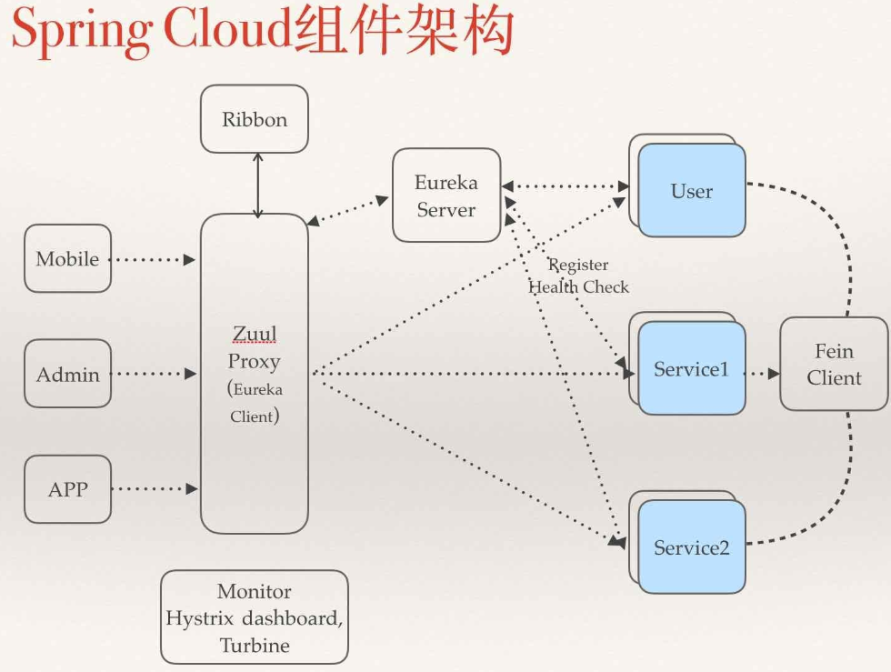

- 所有请求都统一通过 API 网关(Zuul)来访问内部服务。
- 网关接收到请求后，从注册中心(Eureka)获取可用服务。
- 由 Ribbon 进行均衡负载后，分发到后端的具体实例。
- 微服务之间通过 Feign 进行通信处理业务。
- Hystrix 负责处理服务超时熔断。
- Turbine 监控服务间的调用和熔断相关指标。


## 微服务、Spring Cloud、Spring Boot之间的关系

> 微服务是一种架构的理念，提出了微服务的设计原则，从理论为具体的技术落地提供了指导思想。
> Spring Boot 是一套快速配置脚手架，可以基于 Spring Boot 快速开发单个微服务。
> Spring Cloud 是一个基于 Spring Boot 实现的服务治理工具包;Spring Boot 专注于快速、方便集成的单个微服务个体;Spring Cloud 关注全局的服务治理框架。
> Spring Boot / Cloud 是微服务实践的最佳落地方案。


# 服务注册与发现-Eureka

​	Netflix Eureka是由Netflix开源的一款基于REST的服务发现组件，包括Eureka Server和Eureka Client。目前由于公司内部原因，项目已经被冻结。Pivotal公司将Netflix Eureka整合进了Spring Cloud，在Finchley版本中提供了Spring Cloud Netflix Eureka组件。


## Spring Cloud Netflix Eureka入门案例

​	下面我们来体验以下Spring Cloud Netflix Eureka的入门案例，作为Spring Cloud组件的一个模块，Eureka也遵循开箱即用的原则。


### 创建Maven父级pom项目

​	为方便工程管理，我们先创建一个父级pom项目。

​	**创建eureka项目**

​	将demo.zip解压，改名成eureka，删除src文件夹。

​	**修改项目信息**

​	将项目名称调整为eureka。

```xml
<groupId>com.example</groupId>
<artifactId>eureka</artifactId>
<version>0.0.1-SNAPSHOT</version>
<name>eureka</name>
```

​	**调整packaging**

​	将packaging改为pom。

```xml
<packaging>pom</packaging>
```

​	**添加子模块**

​	添加eureka-server和eureka-client模块。

```xml
<modules>
    <module>eureka-server</module>
    <module>eureka-client</module>
</modules>
```

​	**配置属性**

​	在properties中添加Spring Cloud版本属性。

```xml
<properties>
    <project.build.sourceEncoding>UTF-8</project.build.sourceEncoding>
    <project.reporting.outputEncoding>UTF-8</project.reporting.outputEncoding>
    <java.version>1.8</java.version>
    <spring-cloud.version>Finchley.SR2</spring-cloud.version>
</properties>
```

​	**加入Spring Cloud**

​	最后添加Spring Cloud的dependencyManagement。

```xml
<dependencyManagement>
    <dependencies>
        <dependency>
            <groupId>org.springframework.cloud</groupId>
            <artifactId>spring-cloud-dependencies</artifactId>
            <version>${spring-cloud.version}</version>
            <type>pom</type>
            <scope>import</scope>
        </dependency>
    </dependencies>
</dependencyManagement>
```


### 创建Eureka Server模块		

​	**创建eureka-server项目**

​	将demo.zip解压，改名为eureka-server。将eureka-server放入eureka项目中。

​	**修改parent信息**

​	将parent改为eureka项目。

```xml
<parent>
    <groupId>com.example</groupId>
    <artifactId>eureka</artifactId>
    <version>0.0.1-SNAPSHOT</version>
</parent>
```

​	**修改子模块信息**

​	将项目名改为eureka-server，并删除groupId和version

```xml
<artifactId>eureka-server</artifactId>
<name>eureka-server</name>
```

​	**添加依赖**

​	添加Eureka Server依赖

```xml
<dependencies>
    <dependency>
        <groupId>org.springframework.cloud</groupId>
        <artifactId>spring-cloud-starter-netflix-eureka-server</artifactId>
    </dependency>
</dependencies>
```

​	**调整启动类**

​	修改启动类的包名、类名，添加@EnableEurekaServer注解。

```java
package com.example.eureka.server;

import org.springframework.boot.SpringApplication;
import org.springframework.boot.autoconfigure.SpringBootApplication;
import org.springframework.cloud.netflix.eureka.server.EnableEurekaServer;

@EnableEurekaServer
@SpringBootApplication
public class EurekaServerApplication {

	public static void main(String[] args) {
		SpringApplication.run(EurekaServerApplication.class, args);
	}
}
```

​	**添加配置**

​	在application.yml文件中加入Eureka Server相关的配置。

```yml
server:
  port: 8761
spring:
  application:
    name: eureka-server

eureka:
  instance:
    hostname: localhost
  client:
    registerWithEureka: false # 不注册到注册中心
    fetchRegistry: false # 不获取服务列表
    serviceUrl:
      defaultZone: http://${eureka.instance.hostname}:${server.port}/eureka/
  server:
    enableSelfPreservation: false # 不开启自我保护  当Eureka Server节点在短时间内丢失过多客户端时（可能发生了网络分区故障），那么这个节点就会进入自我保护模式。一旦进入该模式，Eureka Server就会保护服务注册表中的信息，不再删除服务注册表中的数据（也就是不会注销任何微服务）。

```


### 创建Eureka Client模块

​	**创建eureka-client项目**

​	将demo.zip解压，改名为eureka-client。将eureka-client放入eureka项目中。

​	**修改parent信息**

​	将parent改为eureka项目。

```xml
<parent>
    <groupId>com.example</groupId>
    <artifactId>eureka</artifactId>
    <version>0.0.1-SNAPSHOT</version>
</parent>
```

​	**修改子模块信息**

​	将项目名改为eureka-client，并删除groupId和version

```xml
<artifactId>eureka-client</artifactId>
<name>eureka-client</name>
```

​	**添加依赖**

​	添加Eureka Client依赖

```xml
<dependencies>
    <dependency>
        <groupId>org.springframework.cloud</groupId>
        <artifactId>spring-cloud-starter-netflix-eureka-client</artifactId>
    </dependency>
</dependencies>
```

​	**调整启动类**

​	修改启动类的包名、类名，添加@EnableEurekaClient注解。

```java
package com.example.eureka.client;

import org.springframework.boot.SpringApplication;
import org.springframework.boot.autoconfigure.SpringBootApplication;
import org.springframework.cloud.netflix.eureka.EnableEurekaClient;

@EnableEurekaClient
@SpringBootApplication
public class EurekaClientApplication {

	public static void main(String[] args) {
		SpringApplication.run(EurekaClientApplication.class, args);
	}
}
```

​	**添加配置**

​	在application.yml文件中加入Eureka Client相关的配置。

```yml
server:
  port: 8081
spring:
  application:
    name: eureka-client

eureka:
  client:
    serviceUrl:
      defaultZone: http://localhost:8761/eureka/
```


### 启动项目

​	分别启动Eureka Server和Eureka Clinet，直接运行main函数即可。

​	启动完成后访问[http://localhost:8761/](http://localhost:8761/)，可以看到服务注册情况。


### Eureka Server API

​	除了上面例子中通过Spring Cloud完成服务注册发现，Eureka Server还提供了API接口，允许其他非Java语言的应用通过API接口调用方式接入Eureka。

​	主要API如下表所示，如需了解具体调用方式，可以参考[《Eureka-REST-operations》](https://github.com/Netflix/eureka/wiki/Eureka-REST-operations)。


​	例如，通过访问Eureka Server的API接口获取注册上来的实例信息，[GET /eureka/apps ](http://localhost:8761/eureka/apps)。

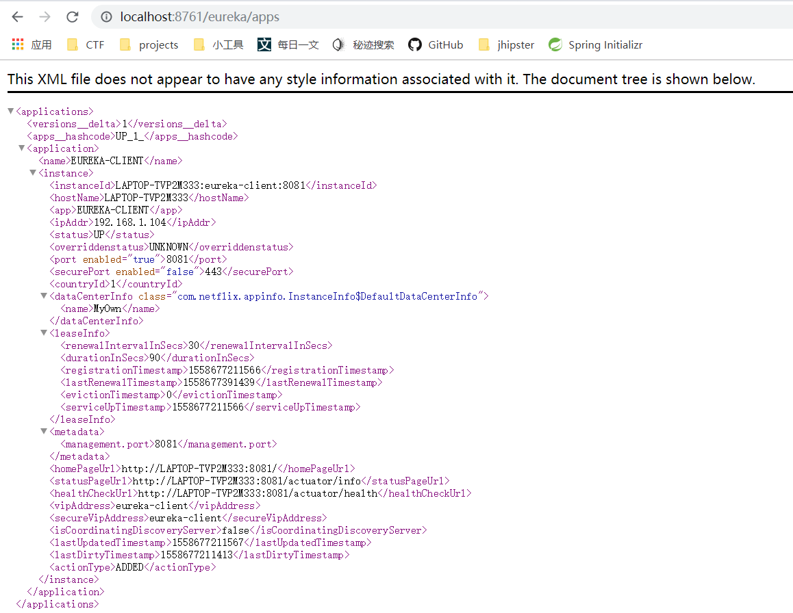


## Eureka参数调优

​	Eureka中主要又三大类核心参数，分别为Instance、Client、Server。参数调优也主要从这三类参数出发。


### Instance参数

**eureka.instance.lease-expiration-duration-in-seconds**

​	leaseExpirationDurationInSeconds，表示Eureka Server至上一次收到Client的心跳之后，等待下一次心跳的超时时间，在这个时间内若没收到下一次心跳，则将移除该Instance。

- 默认90秒。
- 如果该值太大，则很可能将流量转发过去的时候，该Instance已经不存活了。
- 如果该值设置太小了，则Instance则很可能因为临时的网络抖动而被摘除掉。
- 该值至少应该大于leaseRenewalIntervalInSeconds。
- 建议值 30秒。


**eureka.instance.lease-renewal-interval-in-seconds**

​	leaseRenewalIntervalInSeconds，表示Eureka Client发送心跳给Server端的频率。如果在leaseExpirationDurationInSeconds后，Server端没有收到Client的心跳，则将摘除该Instance。除此之外，如果该Instance实现了HealthCheckCallback，并决定让自己unavailable的话，则该Instance也不会接收到流量。

- 默认30秒。
- 建议值10秒。


**eureka.instance.prefer-ip-address**

​	perferIpAddress，表示Eureka Client向Server注册时是否使用Ip地址，如果不是用Ip地址进行注册，将使用运行Instance的服务器的机器名，可能出现机器名无法解析到服务器Ip的问题，造成访问异常。

- 默认值false。
- 建议值true。


### Client参数

**eureka.client.register-with-eureka**

​	registerWithEureka，表示是否将Eureka Client注册到Server上，注册之后就会被其他服务发现并调用，在搭建Eureka集群时，需要开启registerWithEureka，将自己作为服务向其他Server注册自己，这样就形成了相互注册的Server集群。

- 默认值true。


**eureka.client.fetch-registry**

​	fetchRegistry，表示是否从Eureka Server获取Instance列表。

- 默认值true。


**eureka.client.registry-fetch-interval-seconds**

​	registryFetchIntervalSeconds表示Eureka Client间隔多久去拉取服务注册信息，默认为30秒，对于某些服务需要迅速获取服务注册状态，可以缩小该值，比如5秒。

- 默认值30秒
- 网关等服务可以调正为5秒或10秒。


### Server参数

**eureka.server.enable_self_preservation**

​	enableSelfPreservation表示是否开启自我保护 功能。当Eureka Server节点在短时间内丢失过多客户端时（可能发生了网络分区故障），那么这个节点就会进入自我保护模式。一旦进入该模式，Eureka Server就会保护服务注册表中的信息，不再删除服务注册表中的数据（也就是不会注销任何微服务）。

- 默认值true。
- 生产环境建议开启。
- 测试环境建议关闭。


**eureka.server.eviction-interval-timer-in-ms**

​	evictionIntervalTimerInMs表示Eureka Server清理无效节点的时间间隔。针对Client下线没有通知到Server的问题，可以调整EvictionTask的调用频率。

- 默认值60000毫秒，即60秒。
- 建议值30秒。


## Eureka高可用集群

​	在生产环境部署时，我们需要实现Eureka的高可用，根据上节参数调优的建议，我们在入门案例的基础上，新增了高可用的启动配置。


### Eureka Server调整

​	在配置文件中新增peer节点配置。

```yml
spring:
  profiles: peer
server:
  port: 8762

eureka:
  instance:
    hostname: localhost
    lease-expiration-duration-in-seconds: 30
    lease-renewal-interval-in-seconds: 10
    prefer-ip-address: true
  client:
    registerWithEureka: true
    fetchRegistry: true
    serviceUrl:
      defaultZone: http://localhost:8763/eureka/
  server:
    enableSelfPreservation: true
    eviction-interval-timer-in-ms: 30000

```

​	和peer2节点配置。

```yml
spring:
  profiles: peer2
server:
  port: 8763

eureka:
  instance:
    hostname: localhost
    lease-expiration-duration-in-seconds: 30
    lease-renewal-interval-in-seconds: 10
    prefer-ip-address: true
  client:
    registerWithEureka: true
    fetchRegistry: true
    serviceUrl:
      defaultZone: http://localhost:8762/eureka/
  server:
    enableSelfPreservation: true
    eviction-interval-timer-in-ms: 30000

```

​	通过启动参数spring.profiles.active=peer和spring.profiles.active=peer2分别启动集群两个节点。通过eureka.client.serviceUrl.defaultZone相互指定Server地址就可以组成集群。


### Eureka Client调整

​	在配置文件中添加peer节点配置

```yml
spring:
  profiles: peer

eureka:
  instance:
    hostname: localhost
    lease-expiration-duration-in-seconds: 30
    lease-renewal-interval-in-seconds: 10
    prefer-ip-address: true
  client:
    registerWithEureka: true
    fetchRegistry: true
    serviceUrl:
      defaultZone: http://localhost:8762/eureka/,http://localhost:8763/eureka/

```

​	通过启动参数spring.profiles.active=peer启动节点，defaultZone同时指定两个Server地址可以把实例同时注册到两个Server上。


### 启动项目

​	分别启动Eureka Server的peer和peer2，Eureka Client的peer，在IDEA中配置启动信息选择Run->Edit Configurations，新建Application，以Server-peer为例。


​	启动完成后访问[http://localhost:8762/](http://localhost:8762/)或[http://localhost:8763/](http://localhost:8763/)，可以看到服务注册情况。

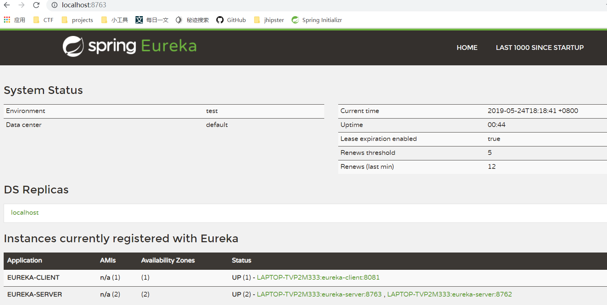


# 微服务网关-Gateway

​	网关是微服务架构中一个重要的组成部分，用来分割微服务和外部环境，外部流量统一通过网关调用微服务集群内部服务。网关主要包含以下功能：

- 验证（用户验证 应用鉴权）
- 路由（动态路由、灰度发布、服务迁移）
- 流量控制（熔断、降级）


## Spring Cloud Gateway

​	Spring Cloud Gateway是Spring官方基于Spring5.0、Spring Boot2.0、Project Reactor等技术开发的网关。旨在为微服务架构提供简单、有效且统一的API路由管理方式，目标是为了代替Netflix Zuul。


### Netflix Zuul

​	Zuul是Netflix孵化的一个致力于网关解决方案的开源组件，后来被Pivotal公司整合到了Spring Cloud生态系统中。Zuul目前已经迭代到了2.x版本，但是在Spring Finchley中继续沿用了Zuul的1.x版本，原因可能是Zuul 2.x版本与1.x版本变动较大。另外Spring Cloud Gateway已经孵化成功，在功能和性能上都比Zuul有较大提升。在本课程中，我们也直接进入到Spring Cloud Gateway中，对于Zuul不再做额外的展开了。


### Gateway工作原理


​	Gateway核心流程图如上图所示，客户端想Gateway发起请求，请求在HttpWebHandlerAdapter中完成网关上下文组装，然后进去DispatcherHandler。DispatcherHandler是所有请求的分发处理器，将请求分发到RoutePredicateHandlerMapping（路由断言处理映射器），RoutePredicateHandlerMapping主要用于路由查找，找到路由后会返回对应的FilteringWebHandler。FilteringWebHandler主要负责组装Filter链表并调用Filter执行一系列的Filter处理，然后把请求转到后端对应的业务服务进行处理。


## Gateway入门案例

​	对网关而言，最重要的功能就是协议适配与协议转换，协议转发是最基本的路由信息转发，这里我们通过一个根据Path转发的例子来了解一下Gateway的基本路由功能。


### 创建Maven项目

​	首先创建一个gateway的父级pom项目。pom文件如下。

```xml
<?xml version="1.0" encoding="UTF-8"?>
<project xmlns="http://maven.apache.org/POM/4.0.0" xmlns:xsi="http://www.w3.org/2001/XMLSchema-instance"
	xsi:schemaLocation="http://maven.apache.org/POM/4.0.0 http://maven.apache.org/xsd/maven-4.0.0.xsd">
	<modelVersion>4.0.0</modelVersion>
	<parent>
		<groupId>org.springframework.boot</groupId>
		<artifactId>spring-boot-starter-parent</artifactId>
		<version>2.0.8.RELEASE</version>
		<relativePath/> <!-- lookup parent from repository -->
	</parent>
	<groupId>com.example</groupId>
	<artifactId>gateway</artifactId>
	<version>0.0.1-SNAPSHOT</version>
	<name>gateway</name>
	<description>Demo project for Spring Boot</description>
	<packaging>pom</packaging>

	<modules>
		<module>gateway-path</module>
	</modules>

	<properties>
		<project.build.sourceEncoding>UTF-8</project.build.sourceEncoding>
		<project.reporting.outputEncoding>UTF-8</project.reporting.outputEncoding>
		<java.version>1.8</java.version>
		<spring-cloud.version>Finchley.SR2</spring-cloud.version>
	</properties>

	<dependencyManagement>
		<dependencies>
			<dependency>
				<groupId>org.springframework.cloud</groupId>
				<artifactId>spring-cloud-dependencies</artifactId>
				<version>${spring-cloud.version}</version>
				<type>pom</type>
				<scope>import</scope>
			</dependency>
		</dependencies>
	</dependencyManagement>


	<dependencies>
		<dependency>
			<groupId>org.springframework.boot</groupId>
			<artifactId>spring-boot-starter</artifactId>
		</dependency>

		<dependency>
			<groupId>org.springframework.boot</groupId>
			<artifactId>spring-boot-starter-test</artifactId>
			<scope>test</scope>
		</dependency>
	</dependencies>

	<build>
		<plugins>
			<plugin>
				<groupId>org.springframework.boot</groupId>
				<artifactId>spring-boot-maven-plugin</artifactId>
			</plugin>
		</plugins>
	</build>

</project>

```


### 创建hell-server子模块

​	在gateway项目中添加hello-server子模块，pom文件如下。

```xml
<?xml version="1.0" encoding="UTF-8"?>
<project xmlns="http://maven.apache.org/POM/4.0.0" xmlns:xsi="http://www.w3.org/2001/XMLSchema-instance"
	xsi:schemaLocation="http://maven.apache.org/POM/4.0.0 http://maven.apache.org/xsd/maven-4.0.0.xsd">
	<modelVersion>4.0.0</modelVersion>
	<parent>
		<groupId>com.example</groupId>
		<artifactId>gateway</artifactId>
		<version>0.0.1-SNAPSHOT</version>
	</parent>
	<artifactId>hello-server</artifactId>
	<name>hello-server</name>
	<description>Demo project for Spring Boot</description>

	<dependencies>
		<dependency>
			<groupId>org.springframework.boot</groupId>
			<artifactId>spring-boot-starter-web</artifactId>
		</dependency>

	</dependencies>

	<build>
		<plugins>
			<plugin>
				<groupId>org.springframework.boot</groupId>
				<artifactId>spring-boot-maven-plugin</artifactId>
			</plugin>
		</plugins>
	</build>

</project>

```

​	添加/hello接口

```java
package com.example.demo;

import org.springframework.boot.SpringApplication;
import org.springframework.boot.autoconfigure.SpringBootApplication;
import org.springframework.web.bind.annotation.GetMapping;
import org.springframework.web.bind.annotation.RestController;

@SpringBootApplication
@RestController
public class HelloApplication {

    @GetMapping("/hello")
    public String hello() throws InterruptedException {
        return "hello";
    }

    public static void main(String[] args) {
        SpringApplication.run(HelloApplication.class, args);
    }

}
```

​	启动项目，通过浏览器访问[http://localhost:8083/hello](http://localhost:8083/hello)，页面显示如下

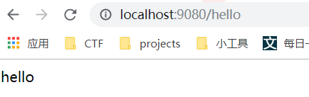


### 创建Path转发Gateway子模块

​	在父级pom工程中添加一个gateway-path子模块，pom文件如下。

```xml
<?xml version="1.0" encoding="UTF-8"?>
<project xmlns="http://maven.apache.org/POM/4.0.0" xmlns:xsi="http://www.w3.org/2001/XMLSchema-instance"
	xsi:schemaLocation="http://maven.apache.org/POM/4.0.0 http://maven.apache.org/xsd/maven-4.0.0.xsd">
	<modelVersion>4.0.0</modelVersion>
	<parent>
		<groupId>com.example</groupId>
		<artifactId>gateway</artifactId>
		<version>0.0.1-SNAPSHOT</version>
	</parent>
	<artifactId>gateway-path</artifactId>
	<name>gateway-path</name>
	<description>Demo project for Spring Boot</description>

	<dependencies>

		<dependency>
			<groupId>org.springframework.cloud</groupId>
			<artifactId>spring-cloud-starter-gateway</artifactId>
		</dependency>

	</dependencies>

	<build>
		<plugins>
			<plugin>
				<groupId>org.springframework.boot</groupId>
				<artifactId>spring-boot-maven-plugin</artifactId>
			</plugin>
		</plugins>
	</build>

</project>

```

​	添加一个RouteLocator实现将/git路由到https://github.com/的路由。

```java
package com.example.demo;

import org.springframework.boot.SpringApplication;
import org.springframework.boot.autoconfigure.SpringBootApplication;
import org.springframework.cloud.gateway.route.RouteLocator;
import org.springframework.cloud.gateway.route.builder.RouteLocatorBuilder;
import org.springframework.context.annotation.Bean;

@SpringBootApplication
public class GatewayPathApplication {

	@Bean
	public RouteLocator pathRouteLocator(RouteLocatorBuilder builder){
		return builder.routes().route(
				r->r.path("/hello").uri("http://localhost:9080").id("hello_route")
		).build();
	}

	public static void main(String[] args) {
		SpringApplication.run(GatewayPathApplication.class, args);
	}

}

```

​	启动项目，并在浏览器中访问[http://localhost:8080/hello](http://localhost:8080/hello)。

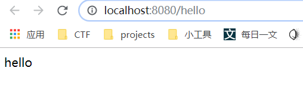

​	

​	上面例子通过代码的方式自定义了Gateway的路由信息，除了代码，Gateway也支持使用配置定义路由信息。

​	同样在父级pom工程中创建一个名为gateway-path-config子模块，pom文件与gateway-path项目一致，然后我们不使用自定义RouteLocator方式，而是在application.yml通过配置定义路由。

```yml
server:
  port:
    8081

spring:
  cloud:
    gateway:
      routes:
        - id: hello_route
          uri: http://localhost:9080
          predicates:
            - Path=/hello
```

​	启动项目，并在浏览器中访问[http://localhost:8081/hello](http://localhost:8081/hello)，可以得到与上面相同的结果。

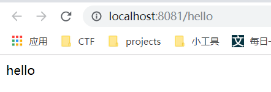

### 网关日志

​	Gateway的日志级别不是Info，想要看到网关的日志，需要修改对应类的日志打印级别。

```yml
logging:
  level:
    org.springframework.cloud.gateway: TRACE
    org.springframework.http.server.reactive: DEBUG
    org.springfremework.web.reactive: DEBUG
    reactor.ipc.netty: DEBUG
```

​	修改打印日志级别后，日志会打印请求的信息，下图是部分的打印日志。


## Gateway路由断言工厂

​	通过上面的案例，我们简单了解了Gateway。Gateway的路由匹配功能是以Spring WebFlux中的Handler Mapping为基础实现的，也包含了许多路由的断言工厂。当Http Request请求进入到Gateway时，路由断言工厂会根据配置的路由规则，对Request进行断言判断，匹配成功后会进入下一步处理，否则断言失败，直接返回错误信息。

​	

### 常用断言工厂

​	Gateway中内置了很多断言工厂，这里我们对常用的断言工厂进行简单介绍。


#### After、Before、Between

​	After、Before、Between三个断言工厂会对请求进来的当前时间与配置的时间进行对比，以Before为例，通过代码和配置实现路由功能如下。

```java
@Bean
public RouteLocator beforeRouteLocator(RouteLocatorBuilder builder){
    ZonedDateTime dateTime = LocalDateTime.now().plusDays(1).atZone(ZoneId.systemDefault());
    return builder.routes().route(
        r -> r.before(dateTime).uri("http://localhost:9080").id("hello_route")
    ).build();
}
```

```yml
spring:
  profiles: before
  cloud:
    gateway:
      routes:
        - id: hello_route
          uri: http://localhost:9080
          predicates:
            - Before=2019-05-26T16:18:02.459+08:00[Asia/Shanghai]
```


#### Cookie

​	Cookie路由断言工厂会判断cookie中的key和value，当请求携带的cookie和断言工厂中配置一致则匹配成功，否则匹配失败。

​	

#### Header

​	Header路由断言工厂根据配置的header信息对请求头进行断言匹配。


#### Host

​	Host路由断言工厂根据配置的host信息对请求的域名进行断言匹配。当访问域名后带端口时，host配置也要带上端口，80端口可以省略。


#### Method

​	Method路由断言工厂根据配置的method对请求方法（Get、Post）进行断言匹配。


#### Query

​	Query路由断言工厂根据配置对请求参数进行断言匹配。


#### RemoteAddr

​	RemoteAddr断言工厂需要配置一个IPv4或IPv6网段的字符串，当请求IP在配置的网段内则匹配成功。


## Gateway Filter

​	除了路由断言工厂，Gateway的另一个重要功能是Filter。Filter允许以某种方式修改Http Request和Response。


### 常用Filter

​	Gateway中内置了很多Filter，这里对常用的Filter进行简单介绍。


#### AddRequestHeader、AddRequestParameter

​	这两个Filter的作用是在路由转发时给请求添加请求头和请求参数，以AddRequestHeader为例，代码和配置如下。

```java
@Bean
public RouteLocator addRequestHeaderRouteLocator(RouteLocatorBuilder builder){
    return builder.routes().route(
        r->r.path("/hello")
        .filters(f -> f.addRequestHeader("test","123"))
        .uri("http://localhost:9080").id("hello_route")
    ).build();
}
```

```yml
spring:
  profiles: addheader
  cloud:
    gateway:
      routes:
        - id: hello_route
          uri: http://localhost:9080
          predicates:
            - Path=/hello
          filters:
            - AddRequestHeader=test,123
```


#### RewritePath、PrefixPath、StripPrefix

​	这三个Filter用于请求URL的修改，RewritePath支持通过正则匹配替换；PrefixPath可以在请求URL前添加自定义前缀；StripPrefix用于去掉部分前缀，例如，StripPrefix=1会将/demo/test/api.do在路由转发时调整为/test/api.do。


#### Hystrix

​	Hystrix(熔断器) 提供熔断、降级等功能，Gateway中也内置了Hystrix Filter，提供路由层面的熔断、降级。当后端服务一直出现异常或服务不可用时，为了提高用户体验，可以通过Hystrix Filter指定异常处理逻辑，返回友好的提示信息，同时也可以保护网关自身的可用性。


### 自定义Filter

​	除了Gateway内置的Filter，我们也可以自己在添加自定义的Filter。Gateway的Filter从接口实现上分为两种：一种是Gateway Filter，另一种是Global Filter。Gateway Filter是从Web Filter中复制过来的，相当于一个Filter过滤器，作用在一个或一组路由上；而Golbal Filter是Gateway重新定义的Filter，是一个全局的Filter，作用于所有路由。

​	下面我们通过一个例子来学习一下如何自定义Filter。


#### 创建gateway-filter子模块

​	在gateway项目中创建gateway-filter子模块，pom文件如下。

```xml
<?xml version="1.0" encoding="UTF-8"?>
<project xmlns="http://maven.apache.org/POM/4.0.0" xmlns:xsi="http://www.w3.org/2001/XMLSchema-instance"
	xsi:schemaLocation="http://maven.apache.org/POM/4.0.0 http://maven.apache.org/xsd/maven-4.0.0.xsd">
	<modelVersion>4.0.0</modelVersion>
	<parent>
		<groupId>com.example</groupId>
		<artifactId>gateway</artifactId>
		<version>0.0.1-SNAPSHOT</version>
	</parent>
	<artifactId>gateway-filter</artifactId>
	<name>gateway-filter</name>
	<description>Demo project for Spring Boot</description>

	<dependencies>

		<dependency>
			<groupId>org.springframework.cloud</groupId>
			<artifactId>spring-cloud-starter-gateway</artifactId>
		</dependency>

		<dependency>
			<groupId>org.projectlombok</groupId>
			<artifactId>lombok</artifactId>
		</dependency>

	</dependencies>

	<build>
		<plugins>
			<plugin>
				<groupId>org.springframework.boot</groupId>
				<artifactId>spring-boot-maven-plugin</artifactId>
			</plugin>
		</plugins>
	</build>

</project>

```

​	添加GatewayFilter的实现类CustomGatewayFilter，功能为打印请求消耗时间。

```java
package com.example.demo;


import lombok.extern.slf4j.Slf4j;
import org.springframework.cloud.gateway.filter.GatewayFilter;
import org.springframework.cloud.gateway.filter.GatewayFilterChain;
import org.springframework.core.Ordered;
import org.springframework.web.server.ServerWebExchange;
import reactor.core.publisher.Mono;

@Slf4j
public class CustomGatewayFilter implements GatewayFilter, Ordered {

    @Override
    public Mono<Void> filter(ServerWebExchange exchange, GatewayFilterChain chain) {
        exchange.getAttributes().put("startTime",System.currentTimeMillis());
        return chain.filter(exchange).then(
                Mono.fromRunnable(() -> {
                    long startTime = exchange.getAttribute("startTime");
                    long cost = System.currentTimeMillis() - startTime;
                    log.info("==== CustomGatewayFilter: {} cost {} ms ====",exchange.getRequest().getURI().getRawPath(),cost);
                })
        );

    }

    @Override
    public int getOrder() {
        return Ordered.HIGHEST_PRECEDENCE+1;
    }
}

```

​	getOrder()方法是来给过滤器设定优先级别的，值越大则优先级越低。需要将自定义的GatewayFilter 注册到路由中，代码如下。

```java
package com.example.demo;

import org.springframework.boot.SpringApplication;
import org.springframework.boot.autoconfigure.SpringBootApplication;
import org.springframework.cloud.gateway.route.RouteLocator;
import org.springframework.cloud.gateway.route.builder.RouteLocatorBuilder;
import org.springframework.context.annotation.Bean;
import org.springframework.web.bind.annotation.GetMapping;
import org.springframework.web.bind.annotation.RestController;

import java.time.LocalDateTime;
import java.time.ZoneId;
import java.time.ZonedDateTime;

@SpringBootApplication
public class GatewayFilterApplication {

	@Bean
	public RouteLocator pathRouteLocator(RouteLocatorBuilder builder){
		return builder.routes().route(
				r->r.path("/hello")
						.filters(f -> f.filter(new CustomGatewayFilter()))
						.uri("http://localhost:8083")
						.id("hello")
		).build();
	}
	
	public static void main(String[] args) {
		SpringApplication.run(GatewayFilterApplication.class, args);
	}

}

```

​	添加GlobalFilter的实现类CustomGlobalFilter，代码于CustomGatewayFilter相似。GlobalFilter作用于全局，不需要注册到路由中，只需添加@Component注解即可。

```
package com.example.demo;

import lombok.extern.slf4j.Slf4j;
import org.springframework.cloud.gateway.filter.GatewayFilterChain;
import org.springframework.cloud.gateway.filter.GlobalFilter;
import org.springframework.core.Ordered;
import org.springframework.stereotype.Component;
import org.springframework.web.server.ServerWebExchange;
import reactor.core.publisher.Mono;

@Slf4j
@Component
public class CustomGlobalFilter implements GlobalFilter, Ordered {
    @Override
    public Mono<Void> filter(ServerWebExchange exchange, GatewayFilterChain chain) {
        exchange.getAttributes().put("startTime2",System.currentTimeMillis());
        return chain.filter(exchange).then(
                Mono.fromRunnable(() -> {
                    long startTime = exchange.getAttribute("startTime2");
                    long cost = System.currentTimeMillis() - startTime;
                    log.info("==== CustomGlobalFilter: {} cost {} ms ====",exchange.getRequest().getURI().getRawPath(),cost);
                })
        );
    }

    @Override
    public int getOrder() {
        return Ordered.HIGHEST_PRECEDENCE+2;
    }
}

```

​	启动项目后，访问[http://localhost:8082/hello](http://localhost:8082/hello)，控制台打印日志如下。

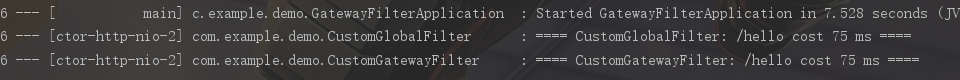


## Gateway与Eureka

​	通过Gateway访问注册到Eureka上的微服务时，可以直接通过服务名访问微服务，同时通过Ribbon实现了负载均衡。


### 创建gateway2项目

​	创建gateway2项目，pom文件如下。

```xml
<?xml version="1.0" encoding="UTF-8"?>
<project xmlns="http://maven.apache.org/POM/4.0.0" xmlns:xsi="http://www.w3.org/2001/XMLSchema-instance"
	xsi:schemaLocation="http://maven.apache.org/POM/4.0.0 http://maven.apache.org/xsd/maven-4.0.0.xsd">
	<modelVersion>4.0.0</modelVersion>
	<parent>
		<groupId>org.springframework.boot</groupId>
		<artifactId>spring-boot-starter-parent</artifactId>
		<version>2.0.8.RELEASE</version>
		<relativePath/> <!-- lookup parent from repository -->
	</parent>
	<groupId>com.example</groupId>
	<artifactId>gateway2</artifactId>
	<version>0.0.1-SNAPSHOT</version>
	<name>gateway2</name>
	<description>Demo project for Spring Boot</description>
	<packaging>pom</packaging>

	<properties>
		<project.build.sourceEncoding>UTF-8</project.build.sourceEncoding>
		<project.reporting.outputEncoding>UTF-8</project.reporting.outputEncoding>
		<java.version>1.8</java.version>
		<spring-cloud.version>Finchley.SR2</spring-cloud.version>
	</properties>

	<dependencyManagement>
		<dependencies>
			<dependency>
				<groupId>org.springframework.cloud</groupId>
				<artifactId>spring-cloud-dependencies</artifactId>
				<version>${spring-cloud.version}</version>
				<type>pom</type>
				<scope>import</scope>
			</dependency>
		</dependencies>
	</dependencyManagement>


	<dependencies>
		<dependency>
			<groupId>org.springframework.boot</groupId>
			<artifactId>spring-boot-starter</artifactId>
		</dependency>

		<dependency>
			<groupId>org.springframework.boot</groupId>
			<artifactId>spring-boot-starter-test</artifactId>
			<scope>test</scope>
		</dependency>
	</dependencies>

	<build>
		<plugins>
			<plugin>
				<groupId>org.springframework.boot</groupId>
				<artifactId>spring-boot-maven-plugin</artifactId>
			</plugin>
		</plugins>
	</build>

</project>

```


### 添加eureka子模块

​	在gateway2项目中添加eureka子模块，pom文件如下。

```xml
<?xml version="1.0" encoding="UTF-8"?>
<project xmlns="http://maven.apache.org/POM/4.0.0" xmlns:xsi="http://www.w3.org/2001/XMLSchema-instance"
	xsi:schemaLocation="http://maven.apache.org/POM/4.0.0 http://maven.apache.org/xsd/maven-4.0.0.xsd">
	<modelVersion>4.0.0</modelVersion>
	<parent>
		<groupId>com.example</groupId>
		<artifactId>gateway2</artifactId>
		<version>0.0.1-SNAPSHOT</version>
	</parent>
	<artifactId>eureka</artifactId>
	<name>eureka</name>
	<description>Demo project for Spring Boot</description>

	<dependencies>
		<dependency>
			<groupId>org.springframework.cloud</groupId>
			<artifactId>spring-cloud-starter-netflix-eureka-server</artifactId>
		</dependency>
	</dependencies>

	<build>
		<plugins>
			<plugin>
				<groupId>org.springframework.boot</groupId>
				<artifactId>spring-boot-maven-plugin</artifactId>
			</plugin>
		</plugins>
	</build>

</project>

```

​	添加配置文件。

```yml
server:
  port: 8761
spring:
  application:
    name: eureka-server

eureka:
  instance:
    hostname: localhost
  client:
    registerWithEureka: false # 不注册到注册中心
    fetchRegistry: false # 不获取服务列表
    serviceUrl:
      defaultZone: http://${eureka.instance.hostname}:${server.port}/eureka/
  server:
    enableSelfPreservation: false # 不开启自我保护  当Eureka Server节点在短时间内丢失过多客户端时（可能发生了网络分区故障），那么这个节点就会进入自我保护模式。一旦进入该模式，Eureka Server就会保护服务注册表中的信息，不再删除服务注册表中的数据（也就是不会注销任何微服务）。

```

​	在启动类中添加@EnableEurekaServer注解。

```java
package com.example.demo;

import org.springframework.boot.SpringApplication;
import org.springframework.boot.autoconfigure.SpringBootApplication;
import org.springframework.cloud.netflix.eureka.server.EnableEurekaServer;

@EnableEurekaServer
@SpringBootApplication
public class EurekaApplication {

	public static void main(String[] args) {
		SpringApplication.run(EurekaApplication.class, args);
	}

}

```


### 添加hello-server子模块

​	在gateway2项目中添加hello-server子模块，pom文件如下。

```xml
<?xml version="1.0" encoding="UTF-8"?>
<project xmlns="http://maven.apache.org/POM/4.0.0" xmlns:xsi="http://www.w3.org/2001/XMLSchema-instance"
	xsi:schemaLocation="http://maven.apache.org/POM/4.0.0 http://maven.apache.org/xsd/maven-4.0.0.xsd">
	<modelVersion>4.0.0</modelVersion>
	<parent>
		<groupId>com.example</groupId>
		<artifactId>gateway2</artifactId>
		<version>0.0.1-SNAPSHOT</version>
	</parent>
	<artifactId>hello-server</artifactId>
	<name>hello-server</name>
	<description>Demo project for Spring Boot</description>

	<dependencies>
		<dependency>
			<groupId>org.springframework.boot</groupId>
			<artifactId>spring-boot-starter-web</artifactId>
		</dependency>

		<dependency>
			<groupId>org.springframework.cloud</groupId>
			<artifactId>spring-cloud-starter-netflix-eureka-client</artifactId>
		</dependency>

	</dependencies>

	<build>
		<plugins>
			<plugin>
				<groupId>org.springframework.boot</groupId>
				<artifactId>spring-boot-maven-plugin</artifactId>
			</plugin>
		</plugins>
	</build>

</project>

```

​	在启动类中添加@EnableEurekaClient注解，并实现/hello接口，接口返回“hello”+name，name的默认值为123，可以在项目启动时，修改name的值。

```java
package com.example.demo;

import org.springframework.beans.factory.annotation.Value;
import org.springframework.boot.SpringApplication;
import org.springframework.boot.autoconfigure.SpringBootApplication;
import org.springframework.cloud.netflix.eureka.EnableEurekaClient;
import org.springframework.web.bind.annotation.GetMapping;
import org.springframework.web.bind.annotation.RestController;

@SpringBootApplication
@EnableEurekaClient
@RestController
public class HelloApplication {

    @Value("${test.name:123}")
    private String name;

    @GetMapping("/hello")
    public String hello() throws InterruptedException {
        return "hello "+ name;
    }

    public static void main(String[] args) {
        SpringApplication.run(HelloApplication.class, args);
    }

}

```

​	配置文件如下。

```yml
server:
  port: 8081
spring:
  application:
    name: hello-server

eureka:
  client:
    serviceUrl:
      defaultZone: http://localhost:8761/eureka/

```


### 添加gateway-path子模块

​	在gateway2项目中添加gateway-path子模块，pom文件如下。

```xml
<?xml version="1.0" encoding="UTF-8"?>
<project xmlns="http://maven.apache.org/POM/4.0.0" xmlns:xsi="http://www.w3.org/2001/XMLSchema-instance"
	xsi:schemaLocation="http://maven.apache.org/POM/4.0.0 http://maven.apache.org/xsd/maven-4.0.0.xsd">
	<modelVersion>4.0.0</modelVersion>
	<parent>
		<groupId>com.example</groupId>
		<artifactId>gateway2</artifactId>
		<version>0.0.1-SNAPSHOT</version>
	</parent>
	<artifactId>gateway-path</artifactId>
	<name>gateway-path</name>
	<description>Demo project for Spring Boot</description>

	<dependencies>

		<dependency>
			<groupId>org.springframework.cloud</groupId>
			<artifactId>spring-cloud-starter-gateway</artifactId>
		</dependency>
		
		<dependency>
			<groupId>org.springframework.cloud</groupId>
			<artifactId>spring-cloud-starter-netflix-eureka-client</artifactId>
		</dependency>
	</dependencies>

	<build>
		<plugins>
			<plugin>
				<groupId>org.springframework.boot</groupId>
				<artifactId>spring-boot-maven-plugin</artifactId>
			</plugin>
		</plugins>
	</build>

</project>

```

​	与Eureka结合使用时，Gateway也需要注册到Eureka。

​	在启动类中添加@EnableEurekaClient注解。

```java
package com.example.demo;

import org.springframework.boot.SpringApplication;
import org.springframework.boot.autoconfigure.SpringBootApplication;
import org.springframework.cloud.gateway.route.RouteLocator;
import org.springframework.cloud.gateway.route.builder.RouteLocatorBuilder;
import org.springframework.cloud.netflix.eureka.EnableEurekaClient;
import org.springframework.context.annotation.Bean;

import java.time.LocalDateTime;
import java.time.ZoneId;
import java.time.ZonedDateTime;

@SpringBootApplication
@EnableEurekaClient
public class GatewayPathApplication {
	
	public static void main(String[] args) {
		SpringApplication.run(GatewayPathApplication.class, args);
	}

}

```

​	添加配置文件

```yml
server:
  port:
    8080


eureka:
  client:
    serviceUrl:
      defaultZone: http://localhost:8761/eureka/

spring:
  application:
    name: gateway
  cloud:
    gateway:
      routes:
        - id: hello_route
          uri: lb://hello-server
          predicates:
            - Path=/api/**
          filters:
            - StripPrefix=1
```


### 功能验证

​	分别启动eureka、gateway、hello-server模块，hello-server启动第二个实例时使用下面的配置

```sh
-Dserver.port=8082 -Dtest.name=aaa
```

​	启动完成后可以看到eureka上注册了一个gateway和两个hello-server。

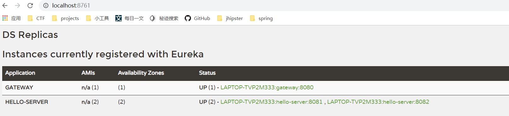

​	在浏览器中访问[http://localhost:8080/api/hello](http://localhost:8080/api/hello)，可以看到交替返回hello 123与hello aaa。

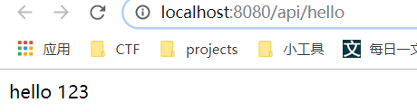

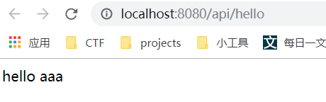


# Spring Cloud 接口调用

​	在微服务项目中，我们一般采用RestTemplate和Feign实现接口调用。


## RestTemplate

​	RestTemplate是Spring提供的用于访问Rest服务的客户端，RestTemplate提供了多种便捷访问远程Http服务的方法，能够大大提高客户端的编写效率。 调用RestTemplate的默认构造函数，RestTemplate对象在底层通过使用java.net包下的实现创建HTTP 请求，可以通过使用ClientHttpRequestFactory指定不同的HTTP请求方式。 ClientHttpRequestFactory接口主要提供了两种实现方式

- 一种是SimpleClientHttpRequestFactory，使用J2SE提供的方式（既java.net包提供的方式）创建底层的Http请求连接。
- 一种方式是使用HttpComponentsClientHttpRequestFactory方式，底层使用HttpClient访问远程的Http服务，使用HttpClient可以配置连接池和证书等信息。 


## RestTemplate实战

​	RestTemplate实战主要讲解如何通过RestTemplate调用Rest服务，Server端使用Spring Boot实战中的user服务。


### 创建http-request项目

​	创建http-request的父pom项目，并将user和eureka项目加入http-request中，作为http-request的子模块。

​	user工程需要注册到eureka中。需要添加eureka-client依赖和配置如下。

```xml
<dependency>
    <groupId>org.springframework.cloud</groupId>
    <artifactId>spring-cloud-starter-netflix-eureka-client</artifactId>
</dependency>
```

```yml
server:
  port: 8081
spring:
  application:
    name: user-server

eureka:
  client:
    serviceUrl:
      defaultZone: http://localhost:8761/eureka/
```

​	并在启动类上添加eureka-clinet注解。

```java
@EnableEurekaClient
```


### 创建http-client子模块

​	在http-request项目中添加http-client子模块。http-client也需要注册到eureka中，需要添加eureka-client相关依赖和配置。

```xml
<dependency>
    <groupId>org.springframework.cloud</groupId>
    <artifactId>spring-cloud-starter-netflix-eureka-client</artifactId>
</dependency>
```

```yml
server:
  port: 8080
spring:
  application:
    name: http-client

eureka:
  client:
    serviceUrl:
      defaultZone: http://localhost:8761/eureka/
```

​	并在启动类上添加eureka-clinet注解。

```java
@EnableEurekaClient
```

​	添加RestTemplate bean。

```
package com.example.demo;

import org.springframework.cloud.client.loadbalancer.LoadBalanced;
import org.springframework.context.annotation.Bean;
import org.springframework.context.annotation.Configuration;
import org.springframework.web.client.RestTemplate;

@Configuration
public class RestTemplateConfig {

    @Bean
    @LoadBalanced
    RestTemplate restTemplate() {
        return new RestTemplate();
    }
}
```

​	在eureka中，@LoadBalanced通过注解RestTemplate后，可以直接使用服务名代替ip地址进行调用。@LoadBalanced注解由Ribbon提供，主要作用是从注册中心获取服务列表，同时提供负载均衡等功能。有关Ribbon的内容会在后面继续讲到，这里不做深入。

​	添加api接口

```java
package com.example.demo;

import lombok.extern.slf4j.Slf4j;
import org.springframework.beans.factory.annotation.Autowired;
import org.springframework.cloud.client.loadbalancer.LoadBalanced;
import org.springframework.context.annotation.Bean;
import org.springframework.web.bind.annotation.GetMapping;
import org.springframework.web.bind.annotation.RestController;
import org.springframework.web.client.RestTemplate;

import java.util.List;

@RestController
@Slf4j
public class ApiController {

    @Autowired
    RestTemplate restTemplate;

    @GetMapping("/api/users")
    public List<User> testGetUsers() {
        List<User> users = (List<User>) restTemplate.getForObject("http://USER-SERVER/users", List.class);
        log.info("==== users:{} ====", users);
        return users;
    }
}
```

​	使用RestTemplate的getForObject调用user的Get /users接口，url直接使用服务器USER-SERVER。在RestTemplate中对GET请求可以通过如下两种方式实现。

​	第一种，getForEntity方法。该方法返回的是ResponseEntity，该对象是Spring对Http请求响应的封装。其中主要存储了HTTP的几个重要元素，比如HTTP请求状态码的枚举对象HttpStatus（我们常说的404,500）、在他的父类HttpEntity中还存储着HTTP请求的头信息对象HttpHeaders以及泛型类型的请求体对象(响应码、contentType、contentLength、响应消息体等)。

​	第二种，getForObject方法。该方法可以理解为getForEntity方法的进一步封装。它通过HttpMessageConverterExtractor对HTTP的请求响应体body内容进行对象转换，实现请求直接返回包装好的对象内容,该函数少了一步获取body的步骤所以更方便。

​	除了Get之外，RestTemplate还实现了post、put、delete等调用方式，除了直接使用具体请求方式，也可以使用exchange方法，通过HttpMethod参数指定请求方式。

```java
 List<User> users = (List<User>) restTemplate.getForObject("http://USER-SERVER/users", List.class);
```

​	等同于

```java
List<User> users =  restTemplate.exchange("http://USER-SERVER/users", HttpMethod.GET, null, List.class).getBody();
```


### 验证RestTemplate调用。 

​	分别启动eureka、user、rest-template服务。


​	在浏览器中访问[http://localhost:8080/api/users](http://localhost:8080/api/users)，可以得到user返回的用户列表。


## Feign

​	Feign是Netflix开发的声明式、模板化的HTTP客户端， Feign可以帮助我们更快捷、优雅地调用HTTP API。

​	Spring Cloud对Feign进行了增强，使Feign支持了Spring MVC注解，并整合了Ribbon和Eureka，从而让Feign的使用更加方便。

​	Spring Cloud Feign是基于Netflix feign实现，整合了Spring Cloud Ribbon和Spring Cloud Hystrix，除了提供这两者的强大功能外，还提供了一种声明式的Web服务客户端定义的方式。

​	Spring Cloud Feign帮助我们定义和实现依赖服务接口的定义。在Spring Cloud feign的实现下，只需要创建一个接口并用注解方式配置它，即可完成服务提供方的接口绑定，简化了在使用Spring Cloud Ribbon时自行封装服务调用客户端的开发量。


### 添加Feign调用逻辑

​	在http-client中实现使用Feign调用user服务。

​	添加pom依赖。

```xml
<dependency>
    <groupId>org.springframework.cloud</groupId>
    <artifactId>spring-cloud-starter-openfeign</artifactId>
</dependency>
```

​	在启动类中添加@EnableFeignClients注解。

```java
@SpringBootApplication
@EnableEurekaClient
@EnableFeignClients
public class HttpClientApplication {
    
	public static void main(String[] args) {
		SpringApplication.run(HttpClientApplication.class, args);
	}
}
```

​	建立Client接口，并在接口中定义调用user服务的方法。

```java
package com.example.demo;

import org.springframework.cloud.openfeign.FeignClient;
import org.springframework.web.bind.annotation.GetMapping;

import java.util.List;

@FeignClient(name = "USER-SERVER")
public interface UserFeignClient {

    @GetMapping("/users")
    public List<User> getUsers();
}

```

​	@FeignClient注解中，name表示调用的服务名（注册在eureka中的服务名）。

​	在ApiController中添加api接口，调用userFeignClient。

```java
@Autowired
UserFeignClient feignClient;

@GetMapping("/api/users2")
public List<User> testGetUsers2() {
    List<User> users = feignClient.getUsers();
    log.info("==== users:{} ====", users);
    return users;
}
```


### 验证Feign调用

​	在浏览器中访问[http://localhost:8080/api/users2](http://localhost:8080/api/users2)，可以得到user返回的用户列表。

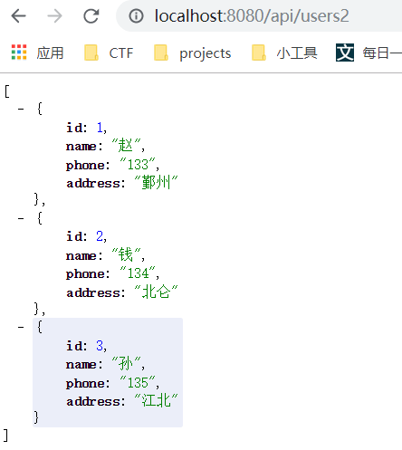


# Spring Cloud Ribbon

​	Ribbon是Netflix开源的一个负载均衡组件，后被Pivotal公司整合进入Spring Cloud生态。它是Spring Cloud微服务体系弹性扩展的基础组件，与其他组件结合可以发挥出强大的作用。Spring Cloud Ribbion主要提供复杂均衡、重试、容错等功能，也可以支持多协议的异步与响应式模型。


## Ribbon与负载均衡

​	负载均衡是指利用一些特定的方式，将流量分摊到多个操作单元上的一种手段，它对系统整体的吞吐量与处理能力有着质的提升。

​	常见的负载均衡产品，例如F5、Nginx，一般位于入口网络与服务提供方之间，负载把网络请求转发到各个服务提供单位，属于集中式的负载均衡，也叫做服务端负载均衡。

​	而Ribbon是从服务调用方出发，从服务提供方的实例库中，挑选一个进行流量访问。实例库一般由Eureka、Zookeeper等注册中心提供。与服务端负载均衡不同，Ribbon是一个客户端的负载均衡。


## Ribbon的负载均衡策略

​	在Spring Cloud Ribbon中一共提供了7中负载均衡策略。

- BestAvailableRule：选择一个最小并发请求的server

- AvailabilityFilteringRule：过滤掉那些因为一直连接失败而被标记为circuit tripped的server，同时过滤掉那些高并发的的后端server（active connections 超过配置的阈值）

- WeightedResponseTimeRule：根据响应时间分配一个权重，响应时间越长，权重越小，被选中的可能性越低。

- RetryRule：在一定时间内不断重试subRule，默认subRule是RoundRobinRule

- RoundRobinRule：轮询访问服务器（默认）

- RandomRule：随机选择一个server进行请求

- ZoneAvoidanceRule：判断server所在区域的性能和server的可用性来综合选择


## Ribbon入门案例

​	在前面介绍Gateway时，我们已经接触过了Ribbon轮询方式的负载均衡。在这个案例中，我们实现一下随机访问（RandomRule）。

​	复制http-request项目并重命名为ribbon项目。

​	在user中添加接口Get /hello，为了方便观察，我们让接口在等待一段时间（1000ms）后返回，代码如下。

```java
@Value("${testName:aaa}")
private String name;

@GetMapping("/hello")
public String hello() throws InterruptedException {
    Thread.sleep(1000);
    return "hello "+ name;
}

```

​	在http-client的UserFeignClient接口中添加对hello接口的调用。

```java
@GetMapping("/hello")
public String hello();
```

​	在http-client的ApiController中添加接口。

```java
@GetMapping("/api/hello")
public String testHello() {
    return feignClient.hello();
}
```

​	通过配置启用基于响应时间的负载均衡。

```yml
ribbon:
  ConnectTimeout: 1000
  ReadTimeout: 5000
USER-SERVER:
  ribbon:
    NFLoadBalancerRuleClassName: com.netflix.loadbalancer.RandomRule
```

​	修改完成后，分别启动eureka、user、http-client服务，启动user需要启动两个实例，第二个实例启动时配置一下启动参数。

```sh
-Dserver.port=9080 -DtestName=123
```

​	启动完成后，可以看到eureka上注册的服务如下。

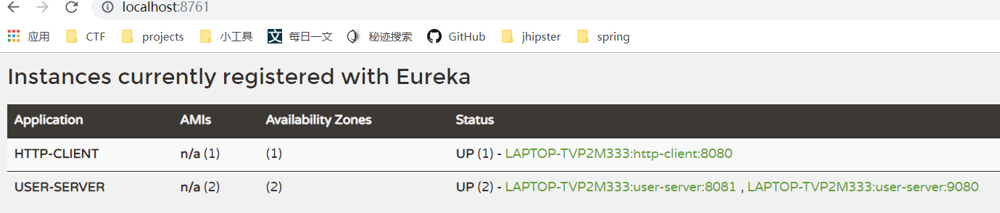

​	在浏览器访问[http://localhost:8080/api/hello](http://localhost:8080/api/hello)。多刷新几次可以发现接口随机返回`hello 123`和`hello aaa`。也通过abtest命令` .\ab.exe -n 1000 -c 1 http://localhost:8080/api/hello`，观察日志打印情况。

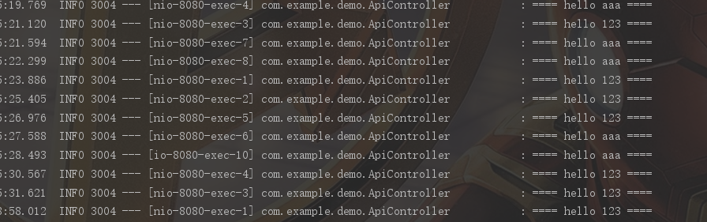


## Ribbon参数调优

​	一般情况下Ribbon的配置为全局配置，也可以为单个服务进行专门配置，如上面的案例中我们对user服务的配置。

​	Ribbon默认开启了重试，在真实项目中容易因为网络不稳定情况造成幂等性问题，建议关闭重试或只开启Get请求的重试。

```yml
ribbon:
  MaxAutoRetries: 0	# 同一个实例重试次数
  MaxAutoRetriesNextServer: 0 # 其他实例重试次数
  OkToRetryOnAllOperations: false # 是否所有操作都重试 false时只重试Get请求
```

​	对于请求超时时间ribbon有ConnectTimeout和ReadTimeout两个配置，对于这两个值需要充分考虑系统运行情况确定，超时时间设置太小，容易造成服务端无法在规定时间内处理完成；超时时间设置太大，在服务端出现异常，大量请求无法及时响应时，很容易造成服务集体雪崩。

​	一般情况下，我们会希望

```yml
ribbon:
  ConnectTimeout: 2000
  ReadTimeout: 5000
```


# Spring Cloud Hystrix

​	Hystrix是由Netflix来源的一个针对分布式系统容错处理的组件，旨在隔离远程系统、服务和第三方库，阻止级联故障，在复杂的分布式系统中实现恢复能力。它通过以下几个机制解决这些问题。

- 隔离：限制调用分布式服务的资源使用，某一个调用的服务出现问题不会影响其他服务调用。
- 降级：超时降级、资源不足时降级等，降级后可以配合降级接口返回托底数据。
- 熔断：当接口调用失败率达到阈值时自动触发降级，熔断器触发的快速失败会进行快速恢复。
- 缓存：提供了请求缓存和请求合并机制。


## Hystrix实战

​	在Hystrix实战中，我们将演示如何实现服务降级和熔断。


### 服务降级

​	服务降级主要解决当服务提供方响应超时或抛出异常等情况下，服务调用方的异常处理逻辑。


#### 创建hystrix-fallback项目

​	复制http-request项目并重命名为hystrix-fallback项目。

​	修改UserFeignClient接口、添加fallback

```java
@FeignClient(name = "USER-SERVER", fallback = UserServerFallback.class)
public interface UserFeignClient {

    @GetMapping("/users")
    public List<User> getUsers();
}
```

​	新增fallback的实现类。

```java
package com.example.demo;

import lombok.extern.slf4j.Slf4j;
import org.springframework.stereotype.Component;

import java.util.List;

@Slf4j
@Component
public class UserServerFallback implements UserFeignClient {

    @Override
    public List<User> getUsers() {
        log.warn("==== fallback worked ====");
        return null;
    }
}

```

​	添加配置文件。

```yml
feign:
  hystrix:
    enabled: true # 开启feign的hystrix功能

hystrix:
  command:
    default:
      execution:
        isolation:
          thread:
            timeoutInMilliseconds: 5000 # 超时时间改为5秒 默认1秒
```


#### 验证

​	分别启动eureka、user、http-client，在浏览器中访问[http://localhost:8080/api/users2](http://localhost:8080/api/users2)，请求正常响应。然后关闭user服务，再次访问请求，页面返回为空，查看http-client的日志可以看到逻辑运行进入了fallback逻辑。

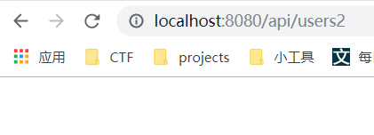


​	然后我们heign功能，重启http-client服务。

```ynl
feign:
  hystrix:
    enabled: false
```

​	重新访问访问[http://localhost:8080/api/users2](http://localhost:8080/api/users2)，可以看到页面出现了500异常信息。查看http-client日志，可以看到无法找到USER-SERVER实例的异常，没有进入fallback逻辑。


### 熔断

​	熔断机制的原理是当接口调用失败率达到阈值时自动触发降级。

​	熔断器一共有三种状态：

- 关闭状态：单位时间内api调用失败次数小于设定阈值时，熔断器处于关闭状态，此时该api可以正常提供服务。
- 打开状态：单位时间内api调用失败次数大于设定阈值时，熔断器处于打开状态，此时请求该api会直接进入fallback逻辑，而不是调用实际api接口。
- 半开状态：一段时间后处于打开状态的熔断器会进入半开状态，并将一定数量的请求调用实际api接口，其他请求仍然直接进入fallback逻辑。若api接口调用失败，熔断器重新进入打开状态；若api调用成功，熔断器恢复到关闭状态。

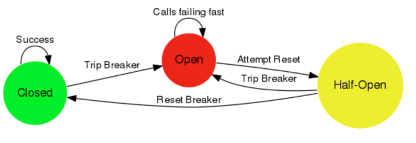


#### 创建hystrix-circuit-breaker项目

​	复制hystrix-fallback项目并重命名为hystrix-circuit-breaker项目。

​	在http-client中添加netflix-hystrix依赖。

```xml
<dependency>
    <groupId>org.springframework.cloud</groupId>
    <artifactId>spring-cloud-starter-netflix-hystrix</artifactId>
</dependency>
```

​	在启动类中添加@EnableCircuitBreaker注解，启用断路器。

```java
package com.example.demo;

import org.springframework.boot.SpringApplication;
import org.springframework.boot.autoconfigure.SpringBootApplication;
import org.springframework.cloud.client.circuitbreaker.EnableCircuitBreaker;
import org.springframework.cloud.netflix.eureka.EnableEurekaClient;
import org.springframework.cloud.openfeign.EnableFeignClients;

@SpringBootApplication
@EnableEurekaClient
@EnableFeignClients
@EnableCircuitBreaker
public class HttpClientApplication {

	public static void main(String[] args) {
		SpringApplication.run(HttpClientApplication.class, args);
	}
}
```

​	添加熔断相关的配置。

```yml
ribbon:
  ConnectTimeout: 5000
  ReadTimeout: 20000
  MaxAutoRetries: 0	# 同一个实例重试次数
  MaxAutoRetriesNextServer: 0 # 其他实例重试次数
  OkToRetryOnAllOperations: false # 是否所有操作都重试 false时只重试Get请求

hystrix:
  command:
    default:
      execution:
        isolation:
          thread:
            timeoutInMilliseconds: 5000 # 配置HystrixCommand的超时时间（毫秒），执行超过该配置值时HystrixCommand被标记为TIMEOUT，并进入降级处理逻辑。
      circuitBreaker:
        requestVolumeThreshold: 2 # 设置在一个滚动窗口中（默认值10秒），打开断路器的最少请求数。
        sleepWindowInMilliseconds: 5000 # 设置断路器打开后休眠时间窗, 休眠时间窗结束后，会将断路器置为“半开”状态，尝试熔断的请求命令，如果成功将断路器置为“打开”状态，失败则继续置为“关闭”状态。
        errorThresholdPercentage: 100 # 设置断路器打开的错误百分比，在滚动时间窗中，请求数超过circuitBreaker.requestVolumeThreshold的前提下，如果错误请求是超过此百分比，就把断路器设置为“打开”，否则设置为“关闭”
  threadpool:
    default:
      metrics:
        rollingStats:
          timeInMilliseconds: 20000 # 设置统计的滚动窗口的时间段大小（毫秒）
          numBuckets: 1 # 设置滚动的统计窗口被分成的桶（bucket）的数目。
```

​	在user项目中添加延时，设置接口响应时间大于hystrix超时时间，同时添加一句日志打印。

```java
@GetMapping("/users")
public List<User> getUsers(@Nullable @RequestParam("phone") String phone)
    throws 	InterruptedException {
    log.info("==== excute get users ====");
    Thread.sleep(6000);
    if (null == phone || phone.isEmpty()) {
        return userService.getUsers();
    } else {
        return userService.getUserByPhoneNo(phone);
    }
}
```


#### 验证

​	分别启动eureka、user、http-client服务，在浏览器中访问[http://localhost:8080/api/users2](http://localhost:8080/api/users2)，前两次访问时，5秒之后会因为hystrix超时进入fallback逻辑；后续访问由于断路器打开，请求会直接进入fallback，不会发生真实请求，说明熔断机制生效；每隔5秒断路器会进入半开状态，向user服务发送一次请求，结果发现响应仍然超时，断路器继续进入打开状态。对照user服务的日志，也可以发现熔断发生时，user服务并没有收到网络请求。


## Hystrix参数调优

​	Feign中自带了Hystrix的功能，但是默认时关闭的，所以我们在使用Feign时，需要开启Hystrix功能。

```yml
feign:
  hystrix:
    enabled: true # 开启feign的hystrix功能
```

​	Hystrix的隔离策略有两种，一种是线程隔离（默认），另一种是信号量隔离。使用线程隔离时，存在ThreadLocal 数据丢失问题，如果使用了ThreadLocal传递数据的，需要解决数据传递问题，可以使用TTL等解决方案；使用信号量隔离不存在这个问题。

​	使用线程隔离时配置如下。

```yml
hystrix:
  threadpool:
    default:
      coreSize: 10 # 线程池核心大小
      maximumSize: 10 # 最大线程池大小
      maxQueueSize: -1 # 线程等待的队列最大值 默认值时-1 使用的是SynchronousQueue 当设置为>0的值时 使用的是LinkedBlockingQueue。
```

​	使用信号量隔离时配置如下。

```yml
hystrix:
  command:
    default:
      execution:
        isolation:
          strategy: SEMAPHORE # 开启信号量隔离
          semaphore:
            maxConcurrentRequests: 500 # 最大并发数 并发超过这个值时 无法获取信号量的请求将被丢弃
```

​	超时时间和熔断相关配置。

```yml
hystrix:
  command:
    default:
      execution:
        isolation:
          thread:
            timeoutInMilliseconds: 5000 # 配置HystrixCommand的超时时间（毫秒），执行超过该配置值时HystrixCommand被标记为TIMEOUT，并进入降级处理逻辑。
      circuitBreaker:
        requestVolumeThreshold: 2 # 设置在一个滚动窗口中（默认值10秒），打开断路器的最少请求数。
        sleepWindowInMilliseconds: 5000 # 设置断路器打开后休眠时间窗, 休眠时间窗结束后，会将断路器置为“半开”状态，尝试熔断的请求命令，如果成功将断路器置为“打开”状态，失败则继续置为“关闭”状态。
        errorThresholdPercentage: 100 # 设置断路器打开的错误百分比，在滚动时间窗中，请求数超过circuitBreaker.requestVolumeThreshold的前提下，如果错误请求是超过此百分比，就把断路器设置为“打开”，否则设置为“关闭”
  threadpool:
    default:
      metrics:
        rollingStats:
          timeInMilliseconds: 20000 # 设置统计的滚动窗口的时间段大小（毫秒）
          numBuckets: 1 # 设置滚动的统计窗口被分成的桶（bucket）的数目。
```


# Spring Cloud监控

​	对于Spring Cloud微服务，有许多开源的监控组件，这里我们介绍三个Spring体系内的监控组件，分别是Hystrix Dashboard（Turbine）、Zipkin、Spring Boot Admin。


## Hystrix Dashboard（Turbine）

​	Hystrix Dashboard主要用来实时监控Hystrix的各项指标信息。通过Hystrix Dashboard反馈的实时信息，可以帮助我们快速发现系统中存在的问题。

​	通过Hystrix Dashboard我们能够看到单个应用内的服务信息, 这明显不够. 我们需要一个工具能让我们汇总系统内多个服务的数据并显示到Hystrix Dashboard上, 这个工具就是Turbine。


### Hystrix Dashboard实战

​	Hystrix Dashboard基础监控功能是对单个实例的监控，Hystrix Dashboard会收集实例暴露出来的监控信息（通过actuator暴露），将这些信息处理后展示出来。

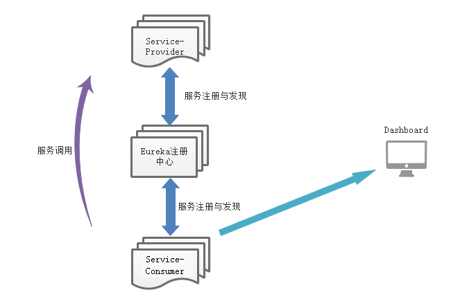


#### 创建hystrix-dashboard项目

​	复制hystrix-circuit-breaker项目并重命名为hystrix-dashboard。


#### http-client修改

​	在http-client中添加actuator依赖，actuator是spring boot提供的对应用系统的自省和监控的集成功能，可以对应用系统进行配置查看、相关功能统计等。

```xml
<dependency>
    <groupId>org.springframework.boot</groupId>
    <artifactId>spring-boot-starter-actuator</artifactId>
</dependency>
```

​	并开启hystrix.stream的endpoints。

```yml
management:
  endpoints:
    web:
      exposure:
        include: hystrix.stream
```

​	也可以同*开启所有endpoints。

```yml
management:
  endpoints:
    web:
      exposure:
        include: "*"
```


#### user修改

​	在user中添加随机0-7秒的随机延时，当接口响应时间超过5秒时，http-client中的hystrix会开启降级，10秒内降级触发两次以上会开启熔断。

```java
@GetMapping("/users")
public List<User> getUsers(@Nullable @RequestParam("phone") String phone) throws InterruptedException {
    log.info("==== excute get users ====");
    int time = (int)(Math.random() * 7000);
    Thread.sleep(time);
    if (null == phone || phone.isEmpty()) {
        return userService.getUsers();
    } else {
        return userService.getUserByPhoneNo(phone);
    }
}
```


#### 创建hystrix-dashboard

​	创建hystrix-dashboard模块。

​	添加依赖。

```xml
<dependencies>
    <dependency>
        <groupId>org.springframework.cloud</groupId>
        <artifactId>spring-cloud-starter-netflix-hystrix-dashboard</artifactId>
    </dependency>
</dependencies>
```

​	启动类中添加@EnableHystrixDashboard注解。

```java
package com.example.demo;

import org.springframework.boot.SpringApplication;
import org.springframework.boot.autoconfigure.SpringBootApplication;
import org.springframework.cloud.netflix.hystrix.dashboard.EnableHystrixDashboard;

@SpringBootApplication
@EnableHystrixDashboard
public class HystrixApplication {

    public static void main(String[] args) {
        SpringApplication.run(HystrixApplication.class, args);
    }
}
```


#### 验证

​	分别启动eureka、http-client、user、hystrix-dashboard四个项目。

​	在浏览器中访问[http://localhost:8085/hystrix](http://localhost:8085/hystrix)，可以看到Hystrix DashBoard的面版，一共提供了三种监控，默认集群监控、自定义集群监控、单实例监控。这里先验证单实例监控。


​	我们需要监控是httl-client的实例，地址为[http://localhost:8080/actuator/hystrix.stream](http://localhost:8080/actuator/hystrix.stream)。我们可以单独在浏览器中访问一下这个地址，可以看到页面上不停输出了ping，在Hystrix DashBoard的页面输入上面的地址，可以看到看板页面显示的是Loading。


​	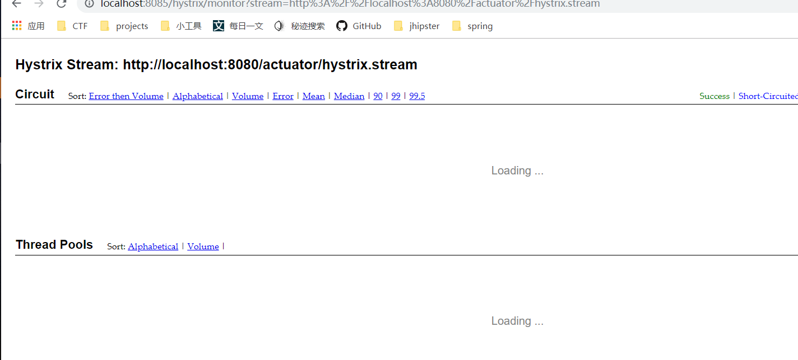

​	然后我们请求一下[http://localhost:8080/api/users2](http://localhost:8080/api/users2)。当完成一次请求后，两个页面分别出现了如下内容。


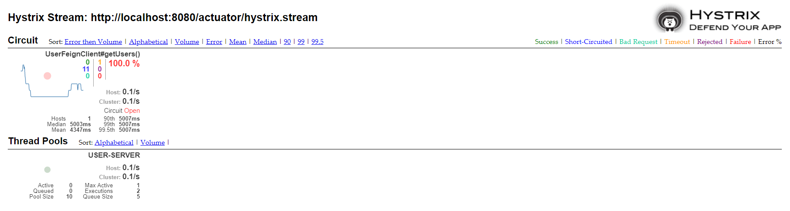

​	Hystrix Dashboard实现的主要功能就是把ping回来的数据处理后通过图标的形式进行展示，让我们更清晰的看到实例的运行情况。

​	Hystrix Dashboard看板主要内容包括

- 圆圈：代表流量的大小和流量的健康，有绿色、黄色、橙色、红色这几个颜色，通过这些颜色的标识，可以快速发现故障、具体的实例、请求压力等。

- 曲线：代表2分钟内流量的变化，可以根据它发现流程的浮动趋势。

- 右边的数字：根据颜色不同分别代表了请求的成功（绿色），熔断数（蓝色），错误的请求（浅绿），超时的请求（橙色），线程池拒绝数（紫色），失败的请求（红色）和最近10秒内错误的比率。

  为了直观的看到监控的变化情况，我们可以使用abtest进行请求模拟

```sh
 .\ab.exe -n 10000 -c 3 http://localhost:8080/api/users2
```

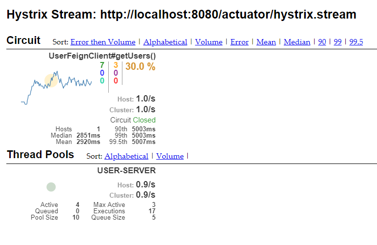


### Turbine实战

​	上面我们搭建了Hystrix Dashboard，可以监控每个服务的hystrix状态的话，但是需要一个服务一个服务去查看，非常麻烦，所以Spring官方又提供了Turbine组件，可以把所有服务的hystrix.stream聚合到一起，可以进行整体监控。

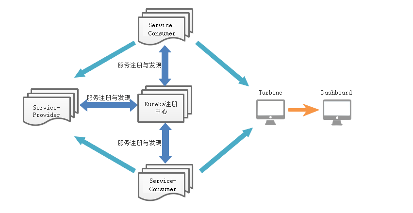


#### 添加turbine模块

​	在hystrix-dashboard项目中添加turbine模块。

​	添加pom依赖。

```xml
<dependency>
    <groupId>org.springframework.cloud</groupId>
    <artifactId>spring-cloud-starter-netflix-turbine</artifactId>
</dependency>
```

​	在启动类中添加@EnableTurbine注解。

```java
package com.example.demo;

import org.springframework.boot.SpringApplication;
import org.springframework.boot.autoconfigure.SpringBootApplication;
import org.springframework.cloud.netflix.turbine.EnableTurbine;

@SpringBootApplication
@EnableTurbine
public class TurbineApplication {

    public static void main(String[] args) {
        SpringApplication.run(TurbineApplication.class, args);
    }
}
```

​	添加配置文件。

```yml
spring:
  application:
    name: hystrix-turbine
server:
  port: 8086

eureka:
  client:
    registerWithEureka: false # 不注册到注册中心
    serviceUrl:
      defaultZone: http://localhost:8761/eureka/

turbine:
  app-config: http-client    # 需要监控的服务名 多个时,分割
  cluster-name-expression: new String("default")
  combine-host: true
```


#### 验证

​	启动turbine，然后在hystrix dashboard中访问http://localhost:8086/turbine.stream，

​	再启动一个http-client的实例，启动配置为`-Dserver.port=9080`。

​	使用abtest模拟请求`.\ab.exe -n 10000 -c 3 http://localhost:8080/api/users2`和`.\ab.exe -n 10000 -c 3 http://localhost:9080/api/users2`。

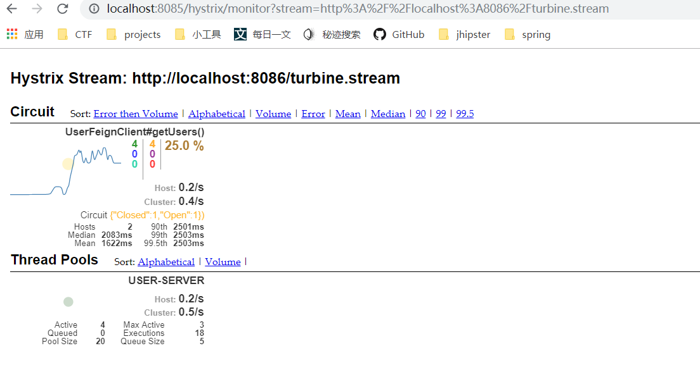

​	可以看到Hosts显示为2。

​	

## Zipkin

​	Zipkin 是 Twitter 的一个开源项目，它基于 Google Dapper 实现，它致力于收集服务的定时数据，以解决微服务架构中的延迟问题，包括数据的收集、存储、查找和展现。 我们可以使用它来收集各个服务器上请求链路的跟踪数据，并通过它提供的 REST API 接口来辅助我们查询跟踪数据以实现对分布式系统的监控程序，从而及时地发现系统中出现的延迟升高问题并找出系统性能瓶颈的根源。

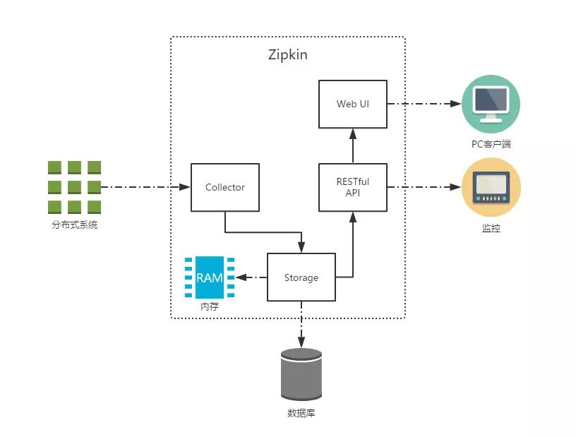

​	Zipkin核心主要有4个模块组成。

- Collector：收集器组件，它主要用于处理从外部系统发送过来的跟踪信息，将这些信息转换为 Zipkin 内部处理的 Span 格式，以支持后续的存储、分析、展示等功能。

- Storage：存储组件，它主要对处理收集器接收到的跟踪信息，默认会将这些信息存储在内存中，我们也可以修改此存储策略，通过使用其他存储组件将跟踪信息存储到数据库中。
- RESTful API：API 组件，它主要用来提供外部访问接口。比如给客户端展示跟踪信息，或是外接系统访问以实现监控等。
- Web UI：UI 组件，基于 API 组件实现的上层应用。通过 UI 组件用户可以方便而有直观地查询和分析跟踪信息。


### Spring Cloud Sleuth与Zipkin

​	Spring Cloud Sleuth主要功能是在分布式系统中提供追踪解决方案，并且兼容支持了zipkin(提供了链路追踪的可视化功能)，

​	Zipkin原理时在服务调用的请求和响应中加入ID,表明上下游请求的关系，利用这些信息，可以可视化地分析服务调用链路和服务间的依赖关系。

​	Sleuth是对Zipkin的封装，对应Span,Trace等信息的生成、接入http request,以及向Zipkin server发送采集信息等全部自动化完成。


### Zipkin实战

​	复制http-request项目，并重命名为zipkin。


#### http-client、user修改

​	在pom文件中添加zipkin依赖。

```xml
<dependency>
    <groupId>org.springframework.cloud</groupId>
    <artifactId>spring-cloud-starter-zipkin</artifactId>
</dependency>
```

​	在配置文件中指定Zipkin服务的地址。

```yml
server:
  port: 8080
spring:
  application:
    name: http-client
  zipkin:
    base-url: http://localhost:9411
  sleuth:
    sampler:
      probability: 1.0 # 采样率为1


eureka:
  client:
    serviceUrl:
      defaultZone: http://localhost:8761/eureka/

```


#### 搭建Zipkin Server

​	Zipkin 的服务端搭建比较简单，没有什么需要自定义扩展的地方，所以在Spring Boot 2.x 版本后，官方就不推荐自行定制编译了，而是直接提供了编译好的 jar 包来给我们使用。我们只要直接从[官网](https://zipkin.apache.org/)下载需要的版本启动就行。在files目录下提供了zipkin-server-2.14.0-exec.jar，直接使用`java -jar`启动就行，默认端口为9411。


#### 验证

​	分别启动eureka、http-client、user和zipkin-server。在浏览器中访问[http://localhost:8080/api/users2](http://localhost:8080/api/users2)几次，然后打开[http://localhost:9411/zipkin/](http://localhost:9411/zipkin/)，点击查找，可以查看最近一点时间内请求调用情况。

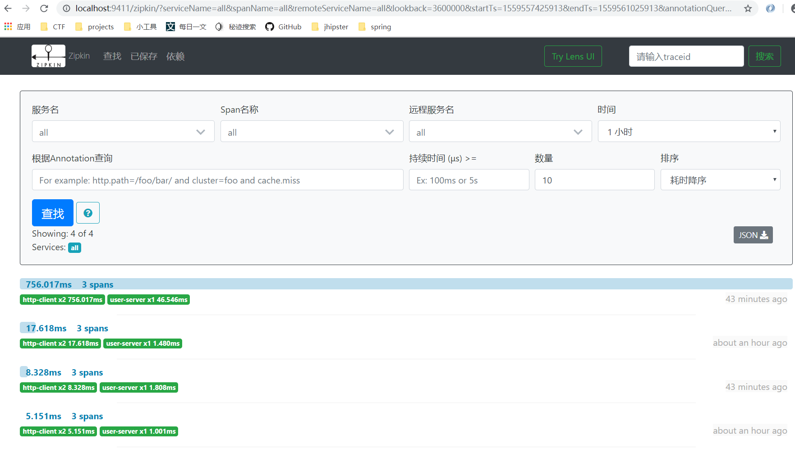

​	点击具体请求可以看到每个调用的耗时。

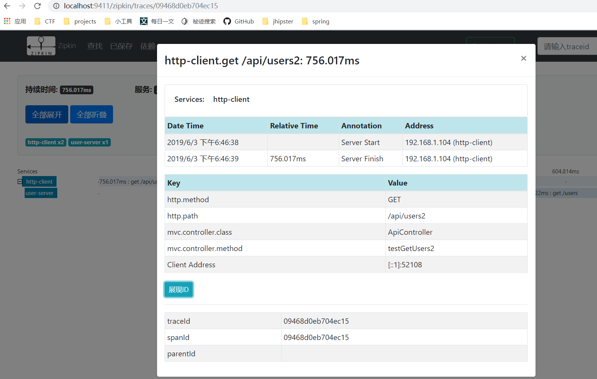

​	上图中的traceId和spanId会在日志打印时打印，也可以通过traceId查找调用链。


​	日志中的三个值分别时工程名、traceId、spanId。

​	在依赖模块中，可以查看微服务的拓扑图。

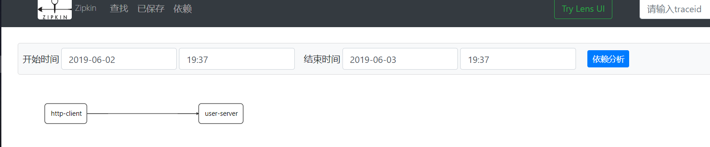

​	

## Spring Boot Admin

​	在前面的例子中我们已经接触过了Actuator，我们可以通过访问不同的端点路径，获取相应的监控信息，但是监控数据都是以JSON串的形式进行返回的，很不直观，而当需要监控的应用越来越多时，依次去访问对应的应用也过于繁琐和低效了。Spring Boot Admin正好解决了这一痛点。

​	Spring Boot Admin是一个管理和监控Spring Boot应用程序的开源软件。每个应用都是一个客户端，通过HTTP或者服务注册发现等方式注册到admin server中进行展示，Spring Boot Admin UI部分使用AngularJs将数据展示在前端。

​	Spring Boot Admin是一个针对Spring Boot的actuator接口进行UI美化封装的监控工具。它可以：在列表中浏览所有被监控实例的基本信息，详细的Health信息、内存信息、JVM信息、垃圾回收信息、各种配置信息（比如数据源、缓存列表和命中率）等，还可以直接修改logger的level。


### Spring Boot Admin实战

​	复制http-request项目，并重命名为spring-boot-admin。


#### http-client、user修改

​	添加actuator依赖。

```xml
<dependency>
    <groupId>org.springframework.boot</groupId>
    <artifactId>spring-boot-starter-actuator</artifactId>
</dependency>
```

​	添加配置文件，暴露所有actuator端点。

```yml
server:
  port: 8080
spring:
  application:
    name: http-client

eureka:
  client:
    serviceUrl:
      defaultZone: http://localhost:8761/eureka/

management:
  endpoints:
    web:
      exposure:
        include: "*" # 暴露所有端点
  endpoint:
    health:
      show-details: ALWAYS
```


#### 创建admin-server

​	在spring-boot-admin项目中添加admin-server模块。

​	在pom中添加依赖。

```xml
<dependency>
    <groupId>org.springframework.cloud</groupId>
    <artifactId>spring-cloud-starter-netflix-eureka-client</artifactId>
</dependency>

<dependency>
    <groupId>de.codecentric</groupId>
    <artifactId>spring-boot-admin-starter-server</artifactId>
    <version>2.0.5</version>
</dependency>
```

​	在启动类中添加@EnableAdminServer注解。

```java
package com.example.demo;

import de.codecentric.boot.admin.server.config.EnableAdminServer;
import org.springframework.boot.SpringApplication;
import org.springframework.boot.autoconfigure.SpringBootApplication;
import org.springframework.cloud.netflix.eureka.EnableEurekaClient;

@SpringBootApplication
@EnableEurekaClient
@EnableAdminServer
public class AdminApplication {

    public static void main(String[] args) {
        SpringApplication.run(AdminApplication.class, args);
    }
}
```

​	添加配置文件

```yml
server:
  port: 8888
spring:
  application:
    name: admin-server

eureka:
  client:
    serviceUrl:
      defaultZone: http://localhost:8761/eureka/

management:
  endpoints:
    web:
      exposure:
        include: "*" # 暴露所有端点
  endpoint:
    health:
      show-details: ALWAYS
```


#### 验证

​	分别启动eureka、http-client、user、admin-server，然后访问[http://localhost:8888/#/applications](http://localhost:8888/#/applications)。

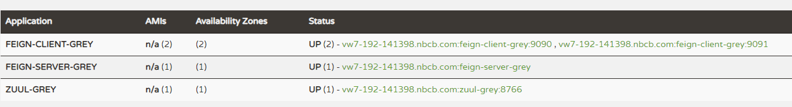

​	点击具体的实例可以查看实例的具体信息。

​	在Details中可以查看实例的基本信息以及内存、线程等信息。

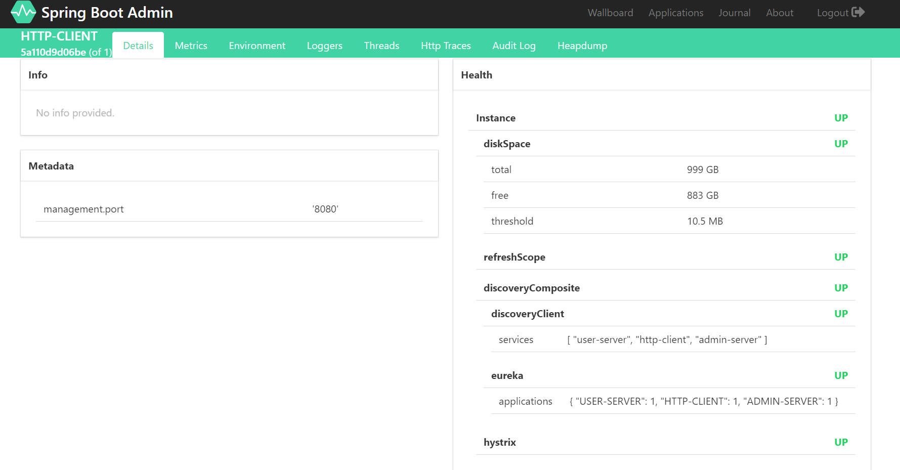

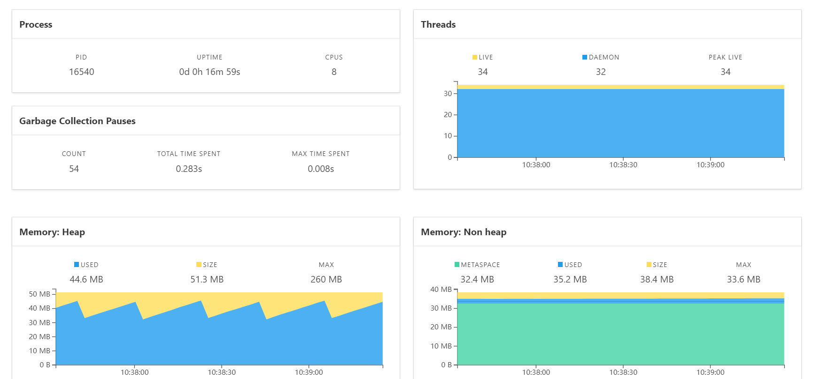

​	在Metrics中可以添加对各种维度数据的监控，例如监控`Get /api/user2`的请求。

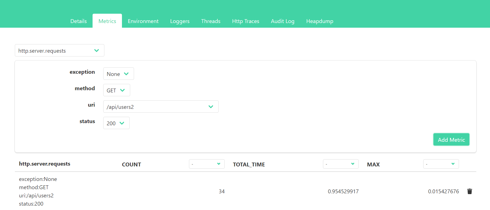

​	在Environment中可以查看实例运行的环境信息。

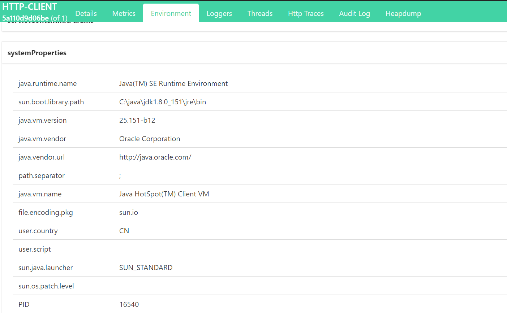

​	在Loggers中可以查看日志级别，也可以实时修改日志级别。

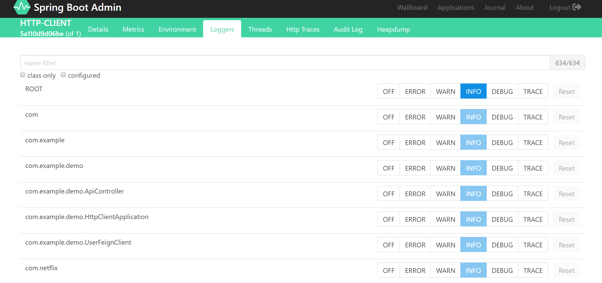

​	在Threads中可以查看当前个线程的运行状态。

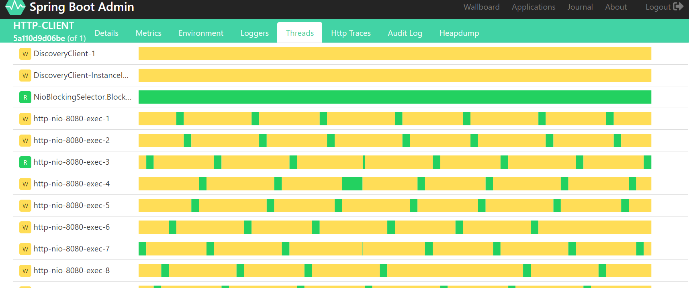

​	在Http Traces中可以查看最近的网络请求情况。

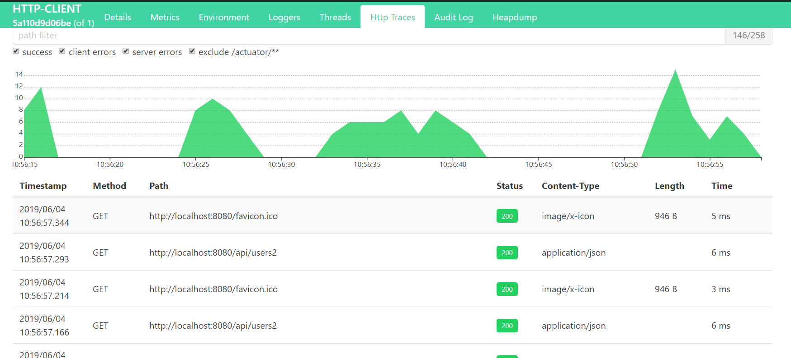

​	Heapdump可以用来获取实例运行的dump文件。


# 配置中心

​	在微服务的模式下，随着程序功能日益复杂，程序的配置日益增多：功能开关、参数配置、服务器地址...同时，我们对程序配置的期望也越来越高：实时生效、灰度发布、环境、集群、灰度...在这样的大环境下，传统的依赖配置文件、数据库等方式实现的管理越来越无法满足对配置管理需求。

​	配置中心就是针对上述问题的最佳解决方案。配置中心通过统一的配置管理，能够集中化的管理应用不同环境、不同集群的配置，配置修改能够实时推送到应用端。


## Spring Cloud Config

​	Spring Cloud Config是Spring提供的一个配置中心，有服务端和客户端组成，服务端提供配置管理的功能，客户端是微服务集群中的各个应用实例。Config支持多种存储配置的形式，主要有git、svn、jdbc、native等。


### Spring Cloud Config实战

​	这里主要介绍一下基于本地（native）的Config实战，其他几种方式基本类似。


#### 创建config项目

​	创建父级pom项目config，pom文件如下。

```xml
<?xml version="1.0" encoding="UTF-8"?>
<project xmlns="http://maven.apache.org/POM/4.0.0" xmlns:xsi="http://www.w3.org/2001/XMLSchema-instance"
	xsi:schemaLocation="http://maven.apache.org/POM/4.0.0 http://maven.apache.org/xsd/maven-4.0.0.xsd">
	<modelVersion>4.0.0</modelVersion>
	<parent>
		<groupId>com.example</groupId>
		<artifactId>config</artifactId>
		<version>0.0.1-SNAPSHOT</version>
	</parent>
	<artifactId>config-client</artifactId>
	<name>config-client</name>
	<description>Demo project for Spring Boot</description>

	<dependencies>
		<dependency>
			<groupId>org.springframework.cloud</groupId>
			<artifactId>spring-cloud-config-client</artifactId>
		</dependency>

	</dependencies>

	<build>
		<plugins>
			<plugin>
				<groupId>org.springframework.boot</groupId>
				<artifactId>spring-boot-maven-plugin</artifactId>
			</plugin>
		</plugins>
	</build>
</project>
```


#### 添加config-server子模块

​	在config项目中添加config-server子模块，pom添加config-server依赖。

```xml
<dependency>
    <groupId>org.springframework.cloud</groupId>
    <artifactId>spring-cloud-config-server</artifactId>
</dependency>
```


​	在启动类中添加@EnableConfigServer注解

```java
package com.example.demo;

import org.springframework.boot.SpringApplication;
import org.springframework.boot.autoconfigure.SpringBootApplication;
import org.springframework.cloud.config.server.EnableConfigServer;

@SpringBootApplication
@EnableConfigServer
public class ConfigServerApplication {

    public static void main(String[] args) {
        SpringApplication.run(ConfigServerApplication.class, args);
    }
}
```

​	添加配置文件

```yml
server:
  port: 9090
spring:
  application:
    name: config-server
  profiles:
    active: native
  cloud:
    config:
      server:
        native:
          searchLocations: file:C:\Users\renkan\Desktop\课程-微服务培训（2）\projects\config\config # 配置文件存放路径
```


#### 添加config目录

​	在config项目中创建config目录，在新建的config目录下创建config-client-local.yml配置文件。

```yml
test:
  name: bbb
```


#### 添加config-client子模块

​	在config项目中添加config-client子模块，pom文件中添加config-client和actuator依赖。

```xml
<dependencies>
    <dependency>
        <groupId>org.springframework.cloud</groupId>
        <artifactId>spring-cloud-config-client</artifactId>
    </dependency>

    <dependency>
        <groupId>org.springframework.boot</groupId>
        <artifactId>spring-boot-starter-actuator</artifactId>
    </dependency>
</dependencies>
```

​	创建测试接口，@RefreshScope注解能实现配置中心配置修改后，刷新配置功能。

```java
package com.example.demo;

import org.springframework.beans.factory.annotation.Value;
import org.springframework.boot.SpringApplication;
import org.springframework.boot.autoconfigure.SpringBootApplication;
import org.springframework.cloud.context.config.annotation.RefreshScope;
import org.springframework.web.bind.annotation.GetMapping;
import org.springframework.web.bind.annotation.RestController;

@SpringBootApplication
@RestController
@RefreshScope
public class ConfigClientApplication {

    public static void main(String[] args) {
        SpringApplication.run(ConfigClientApplication.class, args);
    }

    @Value("${test.name:aa}")
    private String name;

    @GetMapping("/test")
    public String getName(){
        return name;
    }
}
```

​	创建bootstrap.yml配置文件。bootstrap中的配置会优先于application的配置加载，因此会去加载远程的配置文件，以下配置会根据client启动时的profiles加载配置中心对应的配置。

```yml
server:
  port: 8080
spring:
  application:
    name: config-client
  cloud:
    config:
      uri: http://localhost:9090
      name: config-client
      profile: ${spring.profiles.active:default}

management:
  endpoints:
    web:
      exposure:
        include: "*" # 暴露所有端点
  endpoint:
    health:
      show-details: ALWAYS
```


#### 验证

​	分别启动config-server和config-client，config-client启动两个实例，第二个实例启动时使用`-Dserver.port=8081 -Dspring.profiles.active=local`配置。

​	在浏览器中访问[http://localhost:9090/config-client/default](http://localhost:9090/config-client/default)和[http://localhost:9090/config-client/local](http://localhost:9090/config-client/local)。

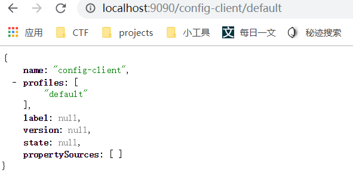

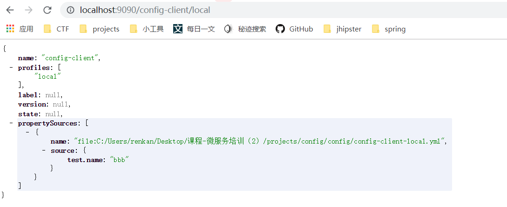

​	可以看到配置中心没有config-client-default的配置，在config-client-local的配置中有`test.name=bbb`的配置。

​	然后分别访问[http://localhost:8080/test](http://localhost:8080/test)和[http://localhost:8081/test](http://localhost:8081/test)。

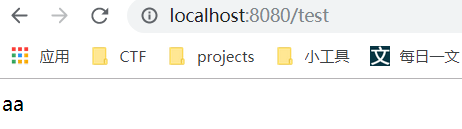

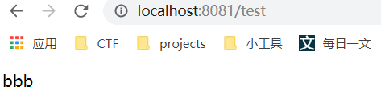

​	两个接口分别返回`aa`和`bbb`，config-client第一次启动时`test.name`没有赋值，所以返回了默认值`aa`，第二次启动时加载了配种中心的`test.name`配置，返回了`bbb`。

​	然后我们修改配置中心`test.name=ccc`。访问`POST http://localhost:8081/actuator/refresh`。

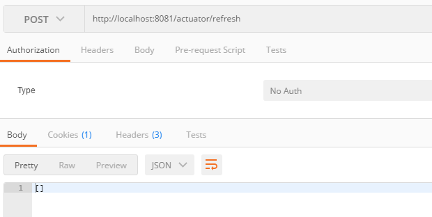

​	再次访问http://localhost:8081/test，可以看到返回结果变成了`ccc`。

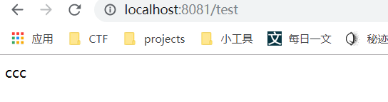

​	在本地验证时，我们通过手动方式刷新了config-client实例的配置，实现了配置热更新。在集群环境中，配置中心的配置修改后，我们可以通过消息中心的形式通知到各个实例，不需要手动刷新。


## Apollo

​	这里简单介绍一下携程开源的配置中心Apollo，github的地址为[https://github.com/ctripcorp/apollo](https://github.com/ctripcorp/apollo)。


### Apollo功能介绍


**基础模型**

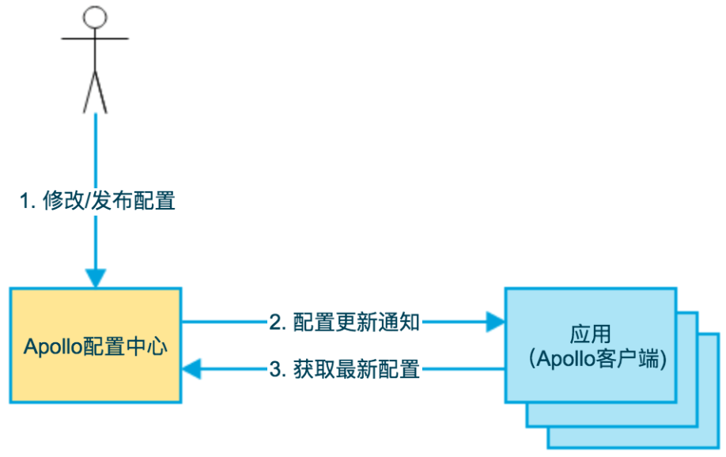

1. 用户在配置中心对配置进行修改并发布
2. 配置中心通知客户端应用配置更新
3. 客户端从配置中心拉取最新配置、更新本地配置并通知到应用


**操作页面**

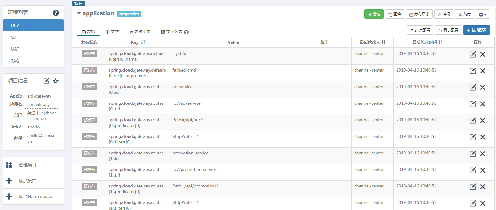

​	在页面左侧展示了项目所有环境和集群、项目信息、可以修改项目信息、创建集群和Namespace。

​	页面右侧是项目的配置信息，可以方便的进行配置修改、发布、灰度、授权、查看更改历史和发布历史。


**添加/修改配置**

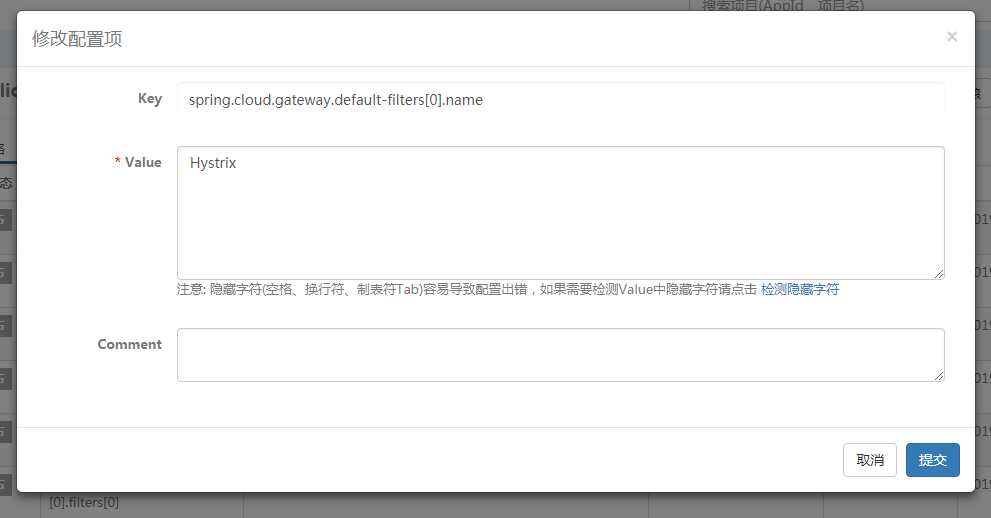

​	点击新增或修改按钮可以对配置进行修改。


**发布配置**

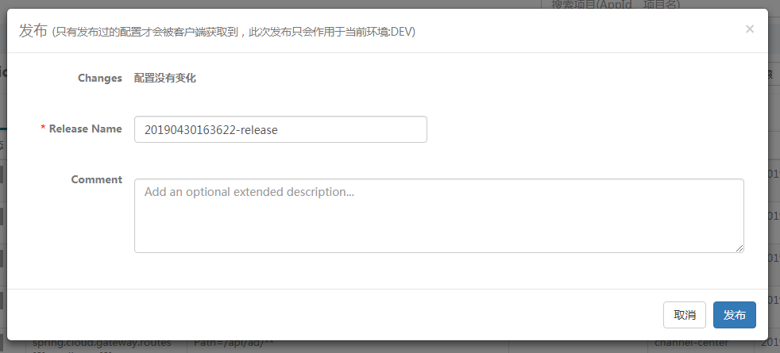

​	点击发布按钮可以发布修改过的配置。


**回滚配置**

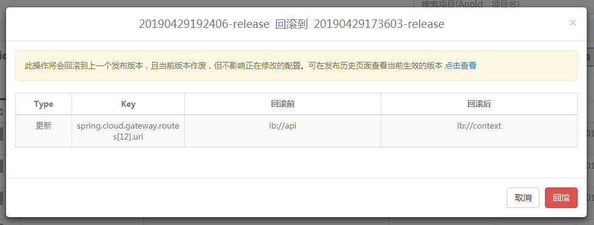

​	点击回滚按钮可以将配置回滚到上一版本。


**历史记录**

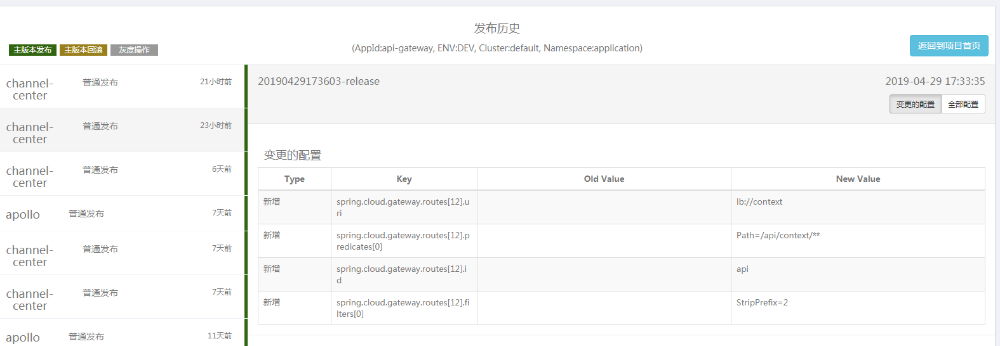

​	点击发布历史可以查看历史发布的配置。


**授权**

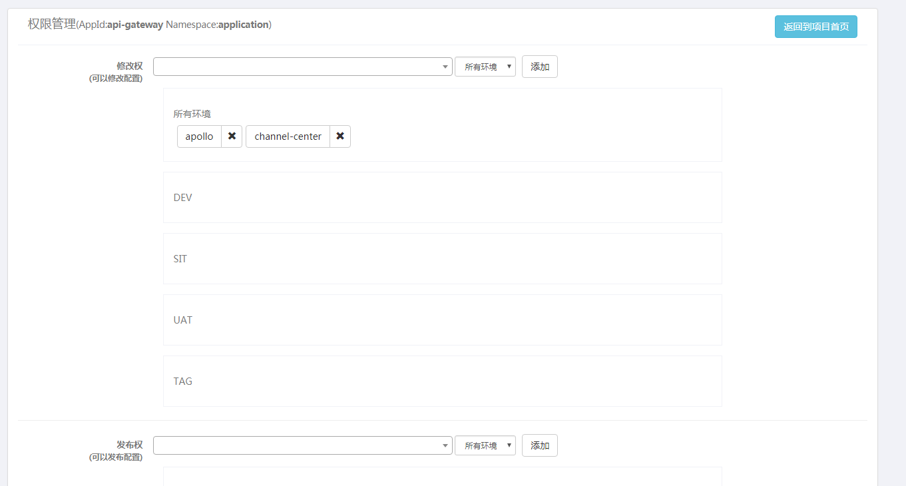

​	点击授权可以对项目配置的修改权限和发布权限进行授权。


**灰度**

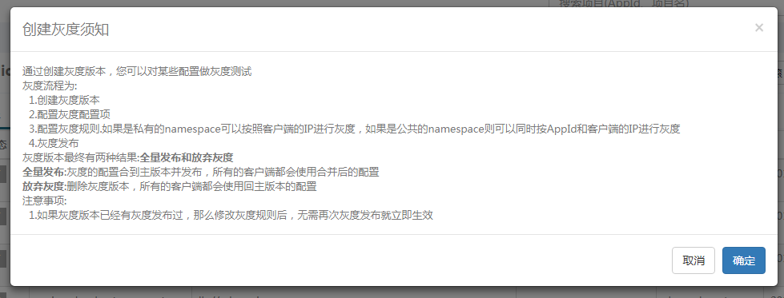

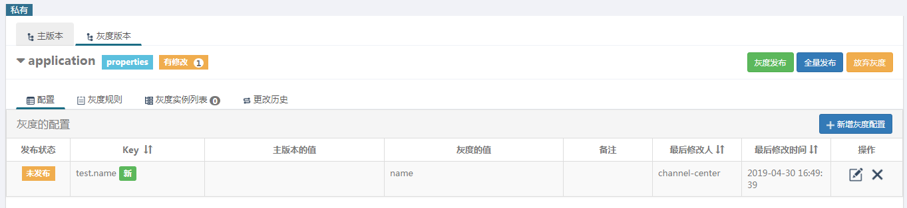

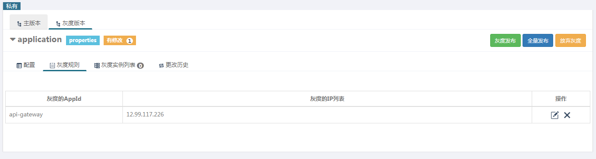

​	点击灰度可以进行配置灰度发布，灰度测试完成后，可以选择全量发布或者放弃灰度。


### Apollo客户端接入

​	客户端在启动时，会从Apollo获取配置，当配置发生变化时，Apollo也会将变化通知到客户端。客户端接入时需要添加apollo-client的依赖。

```xml
<dependency>
    <groupId>com.ctrip.framework.apollo</groupId>
    <artifactId>apollo-client</artifactId>
    <version>${apollo.version}</version>
</dependency>
```


#### Spring Boot项目接入

​	对于Spring Boot项目，只需要在启动类中添加@EnableApolloConfig注解，就可以像使用正常配置一样使用Apollo中的配置了。

```java
package com.example.demo;

import com.ctrip.framework.apollo.spring.annotation.EnableApolloConfig;
import org.springframework.beans.factory.annotation.Value;
import org.springframework.boot.SpringApplication;
import org.springframework.boot.autoconfigure.SpringBootApplication;

@SpringBootApplication
@EnableApolloConfig
public class DemoApplication {

	@Value("${test.timeout:200}")
	private int timeout;

	public static void main(String[] args) {
		SpringApplication.run(DemoApplication.class, args);
	}
}
```

​	

#### 普通Java项目

​	对于普通Java项目需要通过代码获取配置。

```java
Config config = ConfigService.getAppConfig();
int timeout = config.getIntProperty("test.timeout",200);
```


# 渠道中台演示

​	

